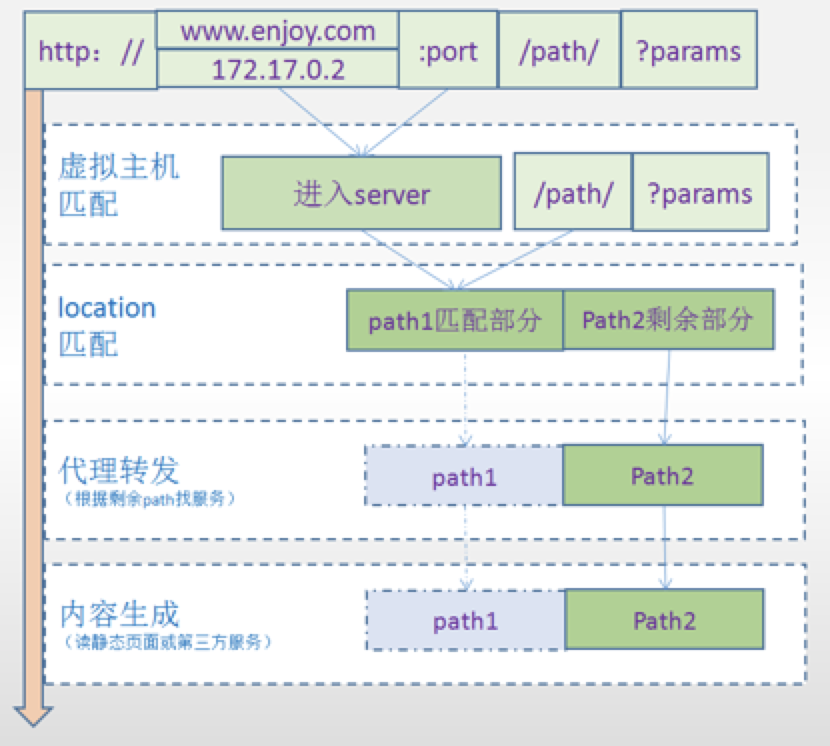
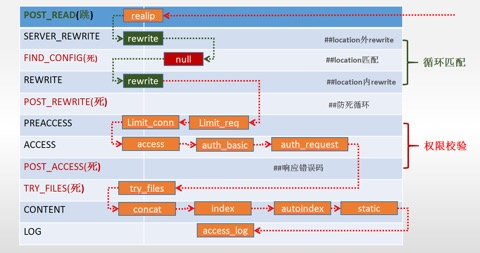

### nginx简介

Nginx 是俄罗斯人编写的十分轻量级的 HTTP 服务器,Nginx，它的发音为“engine X”，是一个高性能的HTTP和反向代理服务器，同时也是一个 IMAP/POP3/SMTP 代理服务器。

Nginx 因为它的稳定性、丰富的模块库、灵活的配置和低系统资源的消耗而闻名．业界一致认为它是 Apache2.2＋mod_proxy_balancer 的轻量级代替者，不仅是因为响应静态页面的速度非常快，而且它的模块数量达到 Apache 的近 2/3。对 proxy 和 rewrite 模块的支持很彻底，还支持 mod_fcgi、ssl、vhosts ，适合用来做 mongrel clusters 的前端 HTTP 响应。

目前Nginx在国内很多大型企业都有应用，且普及率呈逐年上升趋势。选择Nginx的理由也很简单：

第一，它可以支持5W高并发连接；

第二，内存消耗少；

第三，成本低。

##### Nginx在架构中发挥的作用

###### 网关

​    ---面向客户的总入口。 

###### **虚拟主机** 

​    ---一台机器为不同的域名/ip/端口提供服务 

###### **路由** 

​    ---使用反向代理，整合后续服务为一个完整业务 

###### 静态服务器

​    ---mvvm模式中，用来发布前端html/css/js/img 

###### 负载集群

​    ---使用upstream，负载多个tomcat

### nginx架构设计

#### nginx的模块化设计

高度模块化的设计是 Nginx 的架构基础。Nginx 服务器被分解为多个模块，每个模块就是一个功能模块，只负责自身的功能，模块之间严格遵循“高内聚，低耦合”的原则。

##### **核心模块**

核心模块是 Nginx 服务器正常运行必不可少的模块，提供错误日志记录、配置文件解析、事件驱动机制、进程管理等核心功能。

##### **标准** **HTTP** **模块**

标准 HTTP 模块提供 HTTP 协议解析相关的功能，如：端口配置、网页编码设置、HTTP 响应头设置等。

##### **可选** **HTTP** **模块**

可选 HTTP 模块主要用于扩展标准的 HTTP 功能，让 Nginx 能处理一些特殊的服务，如：Flash 多媒体传输、解析 GeoIP 请求、SSL 支持等。

##### **邮件服务模块**

邮件服务模块主要用于支持 Nginx 的邮件服务，包括对 POP3 协议、IMAP 协议和 SMTP 协议的支持。

##### 第三方模块

第三方模块是为了扩展 Nginx 服务器应用，完成开发者自定义功能，如：Json 支持、Lua 支持等。

#### nginx多进程模型

服务器每当收到一个客户端时。就有服务器主进程（master process）生成一个子进程（worker process）出来和客户端建立连接进行交互，直到连接断开，该子进程结束。

使用进程的好处是各个进程之间相互独立，不需要加锁，减少了使用锁对性能造成影响，同时降低编程的复杂度，降低开发成本。

其次，采用独立的进程，可以让进程互相之间不会影响，如果一个进程发生异常退出时，其它进程正常工作，master 进程则很快启动新的 worker 进程，确保服务不中断，将风险降到最低。

缺点是操作系统生成一个子进程需要进行内存复制等操作，在资源和时间上会产生一定的开销；当有大量请求时，会导致系统性能下降。

#### nginx的epoll模式

在某一时刻，进程收集所有的连接，其实这100万连接中大部分是没有事件发生的。因此，如果每次收集事件时，都把这100万连接的套接字传给操作系统（这首先就是用户态内存到内核内存的大量复制），而由操作系统内核寻找这些链接上没有处理的事件，将会是巨大的浪费。

而epoll改进了收集连接的动作，提高效率。

**epoll**的优点：

1. 支持一个进程打开大数目的socket描述符(FD)
2. IO效率不随FD数目增加而线性下降
3. 使用mmap加速内核与用户空间的消息传递

#### 正向代理和反向代理

代理：意思是一个位于客户端和原始服务器(origin server)之间的服务器，为了从原始服务器取得内容，客户端向代理发送一个请求并指定目标(原始服务器)，然后代理向原始服务器转交请求并将获得的内容返回给客户端。

4.2、反向代理，服务端推出的一个代理招牌。

### nginx安装配置

#### 源码编译方式

```sh
安装g++: yum -y install gcc gcc-c++ 

\#一般系统中已经装了了make和g++，无须再装

yum -y install pcre pcre-devel  

yum -y install zlib zlib-devel

yum install -y openssl openssl-devel

\#安装nginx依赖的库

wget  http://nginx.org/download/nginx-1.15.8.tar.gz
tar -zxvf nginx-1.15.8.tar.gz
cd nginx-1.15.8
./configure   --prefix=/usr/local/nginx --with-http_stub_status_module --with-http_ssl_module 
#配置
#--prefix指定安装目录
#--with-http_ssl_module安装https模块
#creating objs/Makefile 代表编译成功
make && make install 
#make编译
#make install安装

```


#### yum方式

```shell
yum install yum-utils 
yum-config-manager --add-repo https://openresty.org/package/centos/openresty.repo 
yum install openresty 
```

#### nginx目录结构

##### conf

配置文件


##### html

网页文件

##### logs

日志文件

##### Sbin

二进制文件

#### nginx常用命令

**启停命令：**

./nginx -c nginx.conf的文件。如果不指定，默认为NGINX_HOME/conf/nginx.conf

./nginx -s stop 停止

./nginx -s quit退出

./nginx -s reload 重新加载nginx.conf

### nginx模型概念

**Nginx**会按需同时运行多个进程：

一个主进程(master)和几个工作进程(worker)，配置了缓存时还会有缓存加载器进程(cache loader)和缓存管理器进程(cache manager)等。

所有进程均是仅含有一个线程，并主要通过“共享内存”的机制实现进程间通信。

主进程以root用户身份运行，而worker、cache loader和cache manager均应以非特权用户身份（user配置项）运行。

**主进程主要完成如下工作：**

1. 读取并验正配置信息
2. 创建、绑定及关闭套接字
3. 启动、终止及维护worker进程的个数
4. 无须中止服务而重新配置工作特性
5. 重新打开日志文件

 

**worker**进程主要完成的任务包括：

1. 接收、传入并处理来自客户端的连接
2. 提供反向代理及过滤功能
3. nginx任何能完成的其它任务

### nginx.conf配置文件结构

###### nginx.conf配置详解

```
#定义Nginx运行的用户和用户组
user www www; 

#nginx进程数，通常设置成和cpu的数量相等
worker_processes 4; 

#全局错误日志定义类型，[debug | info | notice | warn | error | crit]
#error_log  logs/error.log;
#error_log  logs/error.log  notice;
#error_log  logs/error.log  info;


#进程pid文件
#pid        logs/nginx.pid;


#指定进程可以打开的最大描述符：数目
#工作模式与连接数上限
##这个指令是指当一个nginx进程打开的最多文件描述符数目，理论值应该是最多打开文件数（ulimit -n）与nginx进程数相除，但是nginx分配请求并不是那么均匀，所以最好与ulimit -n 的值保持一致。
#这是因为nginx调度时分配请求到进程并不是那么的均衡，所以假如填写10240，总并发量达到3-4万时就有进程可能超过10240了，这时会返回502错误。
worker_rlimit_nofile 65535;


events {
    #参考事件模型，use [ kqueue | rtsig | epoll | /dev/poll | select | poll ]; epoll模型
    #是Linux 2.6以上版本内核中的高性能网络I/O模型，linux建议epoll，如果跑在FreeBSD上面，就用kqueue模型。
    #补充说明：
    #与apache相类，nginx针对不同的操作系统，有不同的事件模型
    #A）标准事件模型
    #Select、poll属于标准事件模型，如果当前系统不存在更有效的方法，nginx会选择select或poll
    #B）高效事件模型
    #Kqueue：使用于FreeBSD 4.1+, OpenBSD 2.9+, NetBSD 2.0 和 MacOS X.使用双处理器的MacOS X系统使用kqueue可能会造成内核崩溃。
    #Epoll：使用于Linux内核2.6版本及以后的系统。
    #/dev/poll：使用于Solaris 7 11/99+，HP/UX 11.22+ (eventport)，IRIX 6.5.15+ 和 Tru64 UNIX 5.1A+。
    #Eventport：使用于Solaris 10。 为了防止出现内核崩溃的问题， 有必要安装安全补丁。
    use epoll
    
    
    #单个进程最大连接数（最大连接数=连接数+进程数）
    #根据硬件调整，和前面工作进程配合起来用，尽量大，但是别把cup跑到100%就行。
    worker_connections  1024;
    
    #keepalive 超时时间
    keepalive_timeout 60;
    
    #客户端请求头部的缓冲区大小。这个可以根据你的系统分页大小来设置，一般一个请求头的大小不会超过1k，不过由于一般系统分页都要大于1k，所以这里设置为分页大小。
    #分页大小可以用命令getconf PAGESIZE 取得。
    #[root@web001 ~]# getconf PAGESIZE
    #但也有client_header_buffer_size超过4k的情况，但是client_header_buffer_size该值必须设置为“系统分页大小”的整倍数。
    client_header_buffer_size 4k;
    
    #这个将为打开文件指定缓存，默认是没有启用的，max指定缓存数量，建议和打开文件数一致，inactive是指经过多长时间文件没被请求后删除缓存。
    open_file_cache max=65535 inactive=60s;
    
    
    #这个是指多长时间检查一次缓存的有效信息。
    #语法:open_file_cache_valid time 默认值:open_file_cache_valid 60 使用字段:http, server, location 这个指令指定了何时需要检查open_file_cache中缓存项目的有效信息.
    open_file_cache_valid 80s;
    
    
    #open_file_cache指令中的inactive参数时间内文件的最少使用次数，如果超过这个数字，文件描述符一直是在缓存中打开的，如上例，如果有一个文件在inactive时间内一次没被使用，它将被移除。
    #语法:open_file_cache_min_uses number 默认值:open_file_cache_min_uses 1 使用字段:http, server, location  这个指令指定了在open_file_cache指令无效的参数中一定的时间范围内可以使用的最小文件数,如果使用更大的值,文件描述符在cache中总是打开状态.
    open_file_cache_min_uses 1;
    
    #语法:open_file_cache_errors on | off 默认值:open_file_cache_errors off 使用字段:http, server, location 这个指令指定是否在搜索一个文件是记录cache错误.
    open_file_cache_errors on;
}


#设定http服务器，利用它的反向代理功能提供负载均衡支持
http{
    #文件扩展名与文件类型映射表
    include mime.types;
    
    #默认文件类型
    default_type application/octet-stream;
    
    #默认编码
    charset utf-8;
    
    #服务器名字的hash表大小
    #保存服务器名字的hash表是由指令server_names_hash_max_size 和server_names_hash_bucket_size所控制的。参数hash bucket size总是等于hash表的大小，并且是一路处理器缓存大小的倍数。在减少了在内存中的存取次数后，使在处理器中加速查找hash表键值成为可能。如果hash bucket size等于一路处理器缓存的大小，那么在查找键的时候，最坏的情况下在内存中查找的次数为2。第一次是确定存储单元的地址，第二次是在存储单元中查找键 值。因此，如果Nginx给出需要增大hash max size 或 hash bucket size的提示，那么首要的是增大前一个参数的大小.
    server_names_hash_bucket_size 128;
    
    #客户端请求头部的缓冲区大小。这个可以根据你的系统分页大小来设置，一般一个请求的头部大小不会超过1k，不过由于一般系统分页都要大于1k，所以这里设置为分页大小。分页大小可以用命令getconf PAGESIZE取得。
    client_header_buffer_size 32k;
    
    #客户请求头缓冲大小。nginx默认会用client_header_buffer_size这个buffer来读取header值，如果header过大，它会使用large_client_header_buffers来读取。
    large_client_header_buffers 4 64k;
    
    #设定通过nginx上传文件的大小
    client_max_body_size 8m;
    
    #开启高效文件传输模式，sendfile指令指定nginx是否调用sendfile函数来输出文件，对于普通应用设为 on，如果用来进行下载等应用磁盘IO重负载应用，可设置为off，以平衡磁盘与网络I/O处理速度，降低系统的负载。注意：如果图片显示不正常把这个改成off。
    #sendfile指令指定 nginx 是否调用sendfile 函数（zero copy 方式）来输出文件，对于普通应用，必须设为on。如果用来进行下载等应用磁盘IO重负载应用，可设置为off，以平衡磁盘与网络IO处理速度，降低系统uptime。
    sendfile on;
    
     #开启目录列表访问，合适下载服务器，默认关闭。
    autoindex on;
    
      #此选项允许或禁止使用socke的TCP_CORK的选项，此选项仅在使用sendfile的时候使用
    tcp_nopush on;
     
    tcp_nodelay on;
    
    #长连接超时时间，单位是秒
    keepalive_timeout 120;
    
    #FastCGI相关参数是为了改善网站的性能：减少资源占用，提高访问速度。下面参数看字面意思都能理解。
    fastcgi_connect_timeout 300;
    fastcgi_send_timeout 300;
    fastcgi_read_timeout 300;
    fastcgi_buffer_size 64k;
    fastcgi_buffers 4 64k;
    fastcgi_busy_buffers_size 128k;
    fastcgi_temp_file_write_size 128k;
    
    #gzip模块设置
    gzip on; #开启gzip压缩输出
    gzip_min_length 1k;    #最小压缩文件大小
    gzip_buffers 4 16k;    #压缩缓冲区
    gzip_http_version 1.0; #压缩版本（默认1.1，前端如果是squid2.5请使用1.0）
    gzip_comp_level 2;     #压缩等级
    gzip_types text/plain application/x-javascript text/css application/xml;    #压缩类型，默认就已经包含textml，所以下面就不用再写了，写上去也不会有问题，但是会有一个warn。
    gzip_vary on;

    #开启限制IP连接数的时候需要使用
    #limit_zone crawler $binary_remote_addr 10m;
    
    
    #负载均衡配置
    upstream piao.jd.com {
     
        #upstream的负载均衡，weight是权重，可以根据机器配置定义权重。weigth参数表示权值，权值越高被分配到的几率越大。
        server 192.168.80.121:80 weight=3;
        server 192.168.80.122:80 weight=2;
        server 192.168.80.123:80 weight=3;

        #nginx的upstream目前支持4种方式的分配
        #1、轮询（默认）
        #每个请求按时间顺序逐一分配到不同的后端服务器，如果后端服务器down掉，能自动剔除。
        #2、weight
        #指定轮询几率，weight和访问比率成正比，用于后端服务器性能不均的情况。
        #例如：
        #upstream bakend {
        #    server 192.168.0.14 weight=10;
        #    server 192.168.0.15 weight=10;
        #}
        #2、ip_hash
        #每个请求按访问ip的hash结果分配，这样每个访客固定访问一个后端服务器，可以解决session的问题。
        #例如：
        #upstream bakend {
        #    ip_hash;
        #    server 192.168.0.14:88;
        #    server 192.168.0.15:80;
        #}
        #3、fair（第三方）
        #按后端服务器的响应时间来分配请求，响应时间短的优先分配。
        #upstream backend {
        #    server server1;
        #    server server2;
        #    fair;
        #}
        #4、url_hash（第三方）
        #按访问url的hash结果来分配请求，使每个url定向到同一个后端服务器，后端服务器为缓存时比较有效。
        #例：在upstream中加入hash语句，server语句中不能写入weight等其他的参数，hash_method是使用的hash算法
        #upstream backend {
        #    server squid1:3128;
        #    server squid2:3128;
        #    hash $request_uri;
        #    hash_method crc32;
        #}

        #tips:
        #upstream bakend{#定义负载均衡设备的Ip及设备状态}{
        #    ip_hash;
        #    server 127.0.0.1:9090 down;
        #    server 127.0.0.1:8080 weight=2;
        #    server 127.0.0.1:6060;
        #    server 127.0.0.1:7070 backup;
        #}
        #在需要使用负载均衡的server中增加 proxy_pass http://bakend/;

        #每个设备的状态设置为:
        #1.down表示单前的server暂时不参与负载
        #2.weight为weight越大，负载的权重就越大。
        #3.max_fails：允许请求失败的次数默认为1.当超过最大次数时，返回proxy_next_upstream模块定义的错误
        #4.fail_timeout:max_fails次失败后，暂停的时间。
        #5.backup： 其它所有的非backup机器down或者忙的时候，请求backup机器。所以这台机器压力会最轻。

        #nginx支持同时设置多组的负载均衡，用来给不用的server来使用。
        #client_body_in_file_only设置为On 可以讲client post过来的数据记录到文件中用来做debug
        #client_body_temp_path设置记录文件的目录 可以设置最多3层目录
        #location对URL进行匹配.可以进行重定向或者进行新的代理 负载均衡
    }
    
    
    #虚拟主机的配置
    server {
        #监听端口
        listen 80;

        #域名可以有多个，用空格隔开
        server_name www.jd.com jd.com;
        #默认入口文件名称
        index index.html index.htm index.php;
        root /data/www/jd;

        #对******进行负载均衡
        location ~ .*.(php|php5)?$
        {
            fastcgi_pass 127.0.0.1:9000;
            fastcgi_index index.php;
            include fastcgi.conf;
        }
         
        #图片缓存时间设置
        location ~ .*.(gif|jpg|jpeg|png|bmp|swf)$
        {
            expires 10d;
        }
         
        #JS和CSS缓存时间设置
        location ~ .*.(js|css)?$
        {
            expires 1h;
        }
         
        #日志格式设定
        #$remote_addr与$http_x_forwarded_for用以记录客户端的ip地址；
        #$remote_user：用来记录客户端用户名称；
        #$time_local： 用来记录访问时间与时区；
        #$request： 用来记录请求的url与http协议；
        #$status： 用来记录请求状态；成功是200，
        #$body_bytes_sent ：记录发送给客户端文件主体内容大小；
        #$http_referer：用来记录从那个页面链接访问过来的；
        #$http_user_agent：记录客户浏览器的相关信息；
        #通常web服务器放在反向代理的后面，这样就不能获取到客户的IP地址了，通过$remote_add拿到的IP地址是反向代理服务器的iP地址。反向代理服务器在转发请求的http头信息中，可以增加x_forwarded_for信息，用以记录原有客户端的IP地址和原来客户端的请求的服务器地址。
        log_format access '$remote_addr - $remote_user [$time_local] "$request" '
        '$status $body_bytes_sent "$http_referer" '
        '"$http_user_agent" $http_x_forwarded_for';
         
        #定义本虚拟主机的访问日志
        access_log  /usr/local/nginx/logs/host.access.log  main;
        access_log  /usr/local/nginx/logs/host.access.404.log  log404;
         
        #对 "/connect-controller" 启用反向代理
        location /connect-controller {
            proxy_pass http://127.0.0.1:88; #请注意此处端口号不能与虚拟主机监听的端口号一样（也就是server监听的端口）
            proxy_redirect off;
            proxy_set_header X-Real-IP $remote_addr;
             
            #后端的Web服务器可以通过X-Forwarded-For获取用户真实IP
            proxy_set_header X-Forwarded-For $proxy_add_x_forwarded_for;
             
            #以下是一些反向代理的配置，可选。
            proxy_set_header Host $host;

            #允许客户端请求的最大单文件字节数
            client_max_body_size 10m;

            #缓冲区代理缓冲用户端请求的最大字节数，
            #如果把它设置为比较大的数值，例如256k，那么，无论使用firefox还是IE浏览器，来提交任意小于256k的图片，都很正常。如果注释该指令，使用默认的client_body_buffer_size设置，也就是操作系统页面大小的两倍，8k或者16k，问题就出现了。
            #无论使用firefox4.0还是IE8.0，提交一个比较大，200k左右的图片，都返回500 Internal Server Error错误
            client_body_buffer_size 128k;

            #表示使nginx阻止HTTP应答代码为400或者更高的应答。
            proxy_intercept_errors on;

            #后端服务器连接的超时时间_发起握手等候响应超时时间
            #nginx跟后端服务器连接超时时间(代理连接超时)
            proxy_connect_timeout 90;

            #后端服务器数据回传时间(代理发送超时)
            #后端服务器数据回传时间_就是在规定时间之内后端服务器必须传完所有的数据
            proxy_send_timeout 90;

            #连接成功后，后端服务器响应时间(代理接收超时)
            #连接成功后_等候后端服务器响应时间_其实已经进入后端的排队之中等候处理（也可以说是后端服务器处理请求的时间）
            proxy_read_timeout 90;

            #设置代理服务器（nginx）保存用户头信息的缓冲区大小
            #设置从被代理服务器读取的第一部分应答的缓冲区大小，通常情况下这部分应答中包含一个小的应答头，默认情况下这个值的大小为指令proxy_buffers中指定的一个缓冲区的大小，不过可以将其设置为更小
            proxy_buffer_size 4k;

            #proxy_buffers缓冲区，网页平均在32k以下的设置
            #设置用于读取应答（来自被代理服务器）的缓冲区数目和大小，默认情况也为分页大小，根据操作系统的不同可能是4k或者8k
            proxy_buffers 4 32k;

            #高负荷下缓冲大小（proxy_buffers*2）
            proxy_busy_buffers_size 64k;

            #设置在写入proxy_temp_path时数据的大小，预防一个工作进程在传递文件时阻塞太长
            #设定缓存文件夹大小，大于这个值，将从upstream服务器传
            proxy_temp_file_write_size 64k;
        }
        
        #本地动静分离反向代理配置
        #所有jsp的页面均交由tomcat或resin处理
        location ~ .(jsp|jspx|do)?$ {
            proxy_set_header Host $host;
            proxy_set_header X-Real-IP $remote_addr;
            proxy_set_header X-Forwarded-For $proxy_add_x_forwarded_for;
            proxy_pass http://127.0.0.1:8080;
        }
    }
}


```


### nginx日志

Nginx日志对于统计、系统服务排错很有用。

Nginx日志主要分为两种：access_log(访问日志)和error_log(错误日志)。

通过访问日志我们可以得到用户的IP地址、浏览器的信息，请求的处理时间等信息。

错误日志记录了访问出错的信息，可以帮助我们定位错误的原因。

因此，将日志好好利用，可以得到很多有价值的信息。

 

查看日志命令：

```sh
1.      tail -f /usr/local/nginx/logs/access.log 
```

#### 设置access_log

访问日志主要记录客户端的请求。客户端向Nginx服务器发起的每一次请求都记录在这里。客户端IP，浏览器信息，referer，请求处理时间，请求URL等都可以在访问日志中得到。当然具体要记录哪些信息，你可以通过log_format指令定义。

##### 语法

```
2.      access_log path [format [buffer=size] [gzip[=level]] [flush=time] [if=condition]]; # 设置访问日志
3.      access_log off; # 关闭访问日志
```

- path 指定日志的存放位置。
- format 指定日志的格式。默认使用预定义的combined
- buffer 用来指定日志写入时的缓存大小。默认是64k
-  gzip 日志写入前先进行压缩。压缩率可以指定，从1到9数值越大压缩比越高，同时压缩的速度也越慢。默认是1
- flush 设置缓存的有效时间。如果超过flush指定的时间，缓存中的内容将被清空
- if 条件判断。如果指定的条件计算为0或空字符串，那么该请求不会写入日志
- 另外，还有一个特殊的值off。如果指定了该值，当前作用域下的所有的请求日志都被关闭


#####  示例

```
     http {
         include       mime.types;
         default_type  application/octet-stream;
      
         log_format  main  '$remote_addr - $remote_user [$time_local] "$request" '
                           '$status $body_bytes_sent "$http_referer" '
                        '"$http_user_agent" "$http_x_forwarded_for"';
            ##日志格式使用默认的combined，指定日志的缓存大小为32k，日志写入前启用gzip进行压缩，压缩比使用默认值1，缓存数据有效时间为1分钟。
      access_log /var/logs/nginx-access.log buffer=32k gzip flush=1m;  
      ...
    }
```

##### 作用域

access_log指令的作用域分别有http，server，location。

#### log_format自定义格式

默认的日志格式

```
15.  log_format  main  '$remote_addr - $remote_user [$time_local] "$request" '
16.                        '$status $body_bytes_sent "$http_referer" '
```

​           '"$http_user_agent" "$http_x_forwarded_for"'; 

各参数明细表：

| $remote_addr          | 客户端的ip地址(代理服务器，显示代理服务ip)           |
| --------------------- | ---------------------------------------------------- |
| $remote_user          | 用于记录远程客户端的用户名称（一般为“-”）            |
| $time_local           | 用于记录访问时间和时区                               |
| $request              | 用于记录请求的url以及请求方法                        |
| $status               | 响应状态码，例如：200成功、404页面找不到等。         |
| $body_bytes_sent      | 给客户端发送的文件主体内容字节数                     |
| $http_user_agent      | 用户所使用的代理（一般为浏览器）                     |
| $http_x_forwarded_for | 可以记录客户端IP，通过代理服务器来记录客户端的ip地址 |
| $http_referer         | 可以记录用户是从哪个链接访问过来的                   |

#### 设置error_log

错误日志在Nginx中是通过error_log指令实现的。该指令记录服务器和请求处理过程中的错误信息。

错误日志不支持自定义。

##### 语法

```
17.    error_log path [level];
```

 

```
l  path参数指定日志的写入位置。
l  level参数指定日志的级别（不写为全部）。level可以是debug, info, notice, warn, error, crit, alert,emerg中的任意值（等级从低到高排列）。
```

只有日志的错误级别等于或高于level指定的值才会写入错误日志中。默认值是error。

##### 示例

```
error_log  logs/error.log; 
error_log  logs/error_notice.log  notice;
error_log  logs/error_info.log  info;                     ##可以将不同的错误类型分开存储
```


#### 日志配置和及切割

/etc/init.d/rsyslog start #系统日志，如不开启，看不到定时任务日志

/etc/rc.d/init.d/crond start #定时任务开启

**编写sh：**

```
#!/bin/bash

#设置日志文件存放目录

LOG_HOME="/usr/local/nginx/logs/"

#备分文件名称

LOG_PATH_BAK="$(date -d yesterday +%Y%m%d%H%M)"

#重命名日志文件

mv ${LOG_HOME}/access.log ${LOG_HOME}/access.${LOG_PATH_BAK}.log

mv ${LOG_HOME}/error.log ${LOG_HOME}/error.${LOG_PATH_BAK}.log

#向nginx主进程发信号重新打开日志

kill -USR1 `cat ${LOG_HOME}/nginx.pid`


```


**配置cron：**

`*/1 * * * * /usr/local/nginx/sbin/logcut.sh`

### nginx安装第三方模式 echo

使用第三方模块ngx_echo的功能，请重新配置添加到nginx插件中

下载第三方模块

wget https://github.com/openresty/echo-nginx-module/archive/v0.61.tar.gz

```sh
tar -zxvf v0.61.tar.gz       ##解压

cd nginx-1.15.8          ##进入nginx源码目录，准备重新配置nginx

 \##配置，--add-module指向模块目录即会安装插件到nginx中

./configure --add-module=/usr/local/src/echo-nginx-module-0.61/

make && make install
```


### 路由--location的使用

#### location语法规则

语法规则： location [=|~|~*|^~] /uri/ {… }

首先匹配 =，其次匹配^~,其次是按文件中顺序的正则匹配，最后是交给 /通用匹配。当有匹配成功时候，停止匹配，按当前匹配规则处理请求。

| 符号    | 含义                                                         |
| ------- | ------------------------------------------------------------ |
| =       | = 开头表示精确匹配                                           |
| ^~      | ^~开头表示uri以某个常规字符串开头，理解为匹配 url路径即可（禁止正则匹配）。 |
| ~       | ~ 开头表示区分大小写的正则匹配                               |
| ~*      | ~* 开头表示不区分大小写的正则匹配                            |
| !~和!~* | !~和!~*分别为区分大小写不匹配及不区分大小写不匹配的正则      |
| /       | 用户所使用的代理（一般为浏览器）                             |

匹配规则优先级如下：

- =精准匹配命中时，停止location动作，直接走精准匹配
-  一般匹配（含非正则）命中时，先收集所有的普通匹配，最后对比出最长的那一条
- 如果最长的那一条普通匹配声明为非正则，直接此条匹配，停止location
- 如果最长的那一条普通匹配不是非正则，继续往下走正则location
- 按代码顺序执行正则匹配，当第一条正则location命中时，停止location

#### path匹配过程



假设http请求路径为

http://192.168.0.132:8088/mvc/index?id=2 ，匹配过程如下：

1. 将整个url拆解为域名/端口/path/params

2. 先由域名/端口，对应到目标server虚拟主机

3. path部分参与location匹配，path = path1匹配部分 + path2剩余部分

4. 进入location方法体内部流程

5. 若是静态文件处理，则进入目标目录查找文件：root指令时找path1+path2对应的文件;alias指令时找path2对应的文件

   若是proxy代理，则形如proxy_pass=ip:port时转发path1+path2路径到tomcat;形如proxy_pass=ip:port/xxx时转发path2路径到tomcat。params始终跟随转发

```
#location指令优先级验证：
#	=精准匹配，最优，匹配就直接返回
#	^~,空 为一般匹配，收集所有匹配，取最长匹配执行（此时不返回，还会执行下面的正则匹配）
#	~,~* 为正则匹配，按顺序依次匹配，命中即返回（可能会覆盖普通匹配）

server {

	listen       80;
	server_name  loc.enjoy.com;

	#精准匹配测试
	#第1，2条虽然匹配，但第三条是精准匹配，出第三条结果
	#测试路径/equal/a/b/c
	location ~ /equal/* {#被命中，但被下面的推断：location = /equal/a/b/c
		echo '/equal/*';
	}
	location /equal/a/b {#被命中，但被下面的推断：location = /equal/a/b/c
		echo '/equal/a/b';
	}
	location = /equal/a/b/c {#被命中，直接执行，不等待
		echo '/equal/a/b/c';
	}

	#普通匹配测试
	#第1，2条虽然匹配，第三条匹配更长，出第三条结果
	#测试路径/match/a/b/c
	location /match/a {#被命中，但不是最长
		return 200  "/match/a";
	}
	location /match/a/b {#被命中，但不是最长
		return 200  "/match/a/b";	
	}
	location /match/a/b/c {#被命中，且最长
		 return 200  "/match/a/b/c";
	}
	location /match/a/b/c/d {#不命中
		return 200  "/match/a/b/c/d"; 
	}

	#正则匹配覆盖普通匹配测试
	#会覆盖普通匹配，不会覆盖=和^~
	location =/re/a.js {#访问/re/a.js，不会被后面的正则覆盖
		echo 'match =';
	}
	location ^~ /re/a/b {#访问/re/a/b开头的路径，不会被后面的正则覆盖
		echo 'math ^~/re/a/b*';
	}
	location /re/a.htm {#访问/re/a.htm，会被后面的正则覆盖
		 echo 'match /re/a.htm';
	}
	location ~ /re/(.*)\.(htm|js|css)$ {#覆盖/re/a.htm路径
		echo "cover /re/$1.$2";
	}

	#正则匹配成功一条后，便不再走其它正则
	#最长正则匹配是第三个，但匹配第一个后便不往下走
	#测试路径/rex/a/b/c.htm
	location ~ /rex/.*\.(htm|js|css)$ {#覆盖/re/a.htm路径
		echo "match first";
	}
	location ~ /rex/a/(.*)\.(htm|js|css)$ {#覆盖/re/a.htm路径
		echo "match second";
	}
	location ~ /rex/a/b/(.*)\.(htm|js|css)$ {#覆盖/re/a.htm路径
		echo "match third";
	}

	location / {
            root   /etc/nginx/html;
            index  c.html;
        }

}

```


### rewrite使用

**rewrite regex replacement [flag];**  

**flag=**【break/last/redirect/permanent】

- regex 是正则表达式
- replacement 是替换值，新值
- flag -- 后续处理标识

#### flag=break

发生nginx内部重定向，path值被更新，rewrite层面的命令会中断。原控制流程逻辑不变往下走

#### flag=last

发生nginx内部重定向，path值被更新，rewrite层面的命令会中断。控制流程刷新，重新进行整个location层的逻辑流程。

#### flag= redirect/permanent

发生页面重定向（301永久重定向/302临时重定向），nginx流程结束，返回http响应到浏览器，页面url更新

#### flag为空

发生nginx内部重定向，path值被更新，rewrite层面的命令继续。最后一个rewrite完毕，刷新控制流程，重新进行location重匹配

demo

```
server {

	listen       80;
	server_name  rew.enjoy.com;

	location /a.html {
		echo 'I am a.html';
	}
	location /b.html {
		echo 'I am b.html';
	}

	#此路径请求：http://rew.enjoy.com/aa.html
	location /aa.html {##内部重定向
		rewrite ^/  /a.html break;##停止指令，流程不变往下走		
		rewrite ^/  /b.html break;	
		root   /etc/nginx/html/;
	}
	

	#此路径请求：http://rew.enjoy.com/ab.html
	location /ab.html {
		rewrite ^/  /a.html last;##停止指令，但重新location匹配
		rewrite ^/  /b.html last;
		rewrite ^/  /c.html;
		root   /etc/nginx/html/;		
	}

	#此路径请求：http://rew.enjoy.com/bb
	location /bb {
		rewrite ^/  /b.html redirect;##302临时重定向
		set $aa 12;
		root   html/;
	}

	#此路径请求：http://rew.enjoy.com/ba
	location /ba {
		rewrite ^/  /b.html permanent;##301永久重定向
		root   html/;
	}

	#此路径请求：http://rew.enjoy.com/cc.html
	location /cc.html {
                rewrite ^/  /c.html;##指令不停，继续往下
                rewrite ^/  /b.html;
                rewrite ^/  /a.html;##最后一条，生效的是这条
                root   /etc/nginx/html/;
        }

}
```


### nginx处理请求的11个阶段



Nginx 处理请求的全过程一共划分为 11 个阶段（如图），按阶段由上到下依次执行 （上一阶段的所有指令执行完毕，才进入下一阶段）

各阶段的含义如下：

1. post-read: 接收到完整的http头部后处理的阶段，在uri重写之前。一般跳过
2. server-rewrite: location匹配前，修改uri的阶段，用于重定向，location块外的重写指令（**多次执行**） 
3. find-config: uri寻找匹配的location块配置项（**多次执行**）
4. rewrite: 找到location块后再修改uri，location级别的uri重写阶段（**多次执行**） 
5. post-rewrite: 防死循环，跳转到对应阶段 
6. preaccess: 权限预处理
7. access: 判断是否允许这个请求进入 
8. post-access: 向用户发送拒绝服务的错误码，用来响应上一阶段的拒绝 
9. try-files: 访问静态文件资源 
10. content : 内容生成阶段，该阶段产生响应，并发送到客户端 
11. log: 记录访问日志 

### upstream--负载

语法格式：

```
upstream 负载名 { 

    [ip_hash;]

    server ip:port  [weight=数字] [down]; 

    server ip:port  [weight=数字];

} 
```

#### 轮询（默认）

```
upstream order {

  server 192.168.0.128:8383;

  server 192.168.244.233:8383;

}
```

不配置weight（即默认weight均为1）

每个请求按时间顺序逐一分配到不同的后端服务器，如果后端服务器down掉，能自动剔除。

#### weight

```
upstream order {

  server 192.168.0.128:8383 weight=3;

  server 192.168.244.233:8383 weight=1 down;

}
```

指定轮询几率，weight和访问比率成正比，用于后端服务器性能不均的情况。

down 暂时不参与负载

#### ip_hash

```
upstream order {

  ip_hash;

  server 192.168.0.128:8383;

  server 192.168.244.233:8383;

}
```

每个请求按访问ip的hash结果分配，这样同一客户端的请求总是发往同一个后端服务器，可以解决session的问题。

#### 代理时的负载使用

格式：proxy_pass http://负载名;

如下图，其传参到下游服务器的规则，与proxy_pass = http://ip:port 一样

```
location /order/enjoy {
               #order 为upstream别名
               proxy_pass http://order/enjoy;
        }
```


### openresty使用

OpenResty是一个全功能的 Web 应用服务器。它打包了标准的 Nginx 核心，常用的第三方模块以及大多数依赖项。 可以把它看成是Nginx附加众多的第三方插件的合集。其主体是嵌入lua脚本的支持，让你能够使用lua灵活地处理运算逻辑。

​    本课程主要讲lua为Nginx带来的新的处理方式，及OpenResty组件的使用。

#### openresty的安装配置

##### 简易的yum安装方式

此方式简单，缺点是无法干预启停插件

yum install yum-utils 

yum-config-manager --add-repo https://openresty.org/package/centos/openresty.repo

yum install openresty 

##### 源码安装方式

wget https://openresty.org/download/openresty-1.15.8.1.tar.gz

tar -zxvf [openresty-1.15.8.1.tar.gz](https://openresty.org/download/openresty-1.15.8.1.tar.gz)

\##选择需要的插件启用, --with-Components 激活组件，--without 则是禁止组件 

./configure --without-http_redis2_module --with-http_iconv_module 

make && make install

 

vi /etc/profile   ##加入path路径

export PATH=$PATH:/usr/local/openresty/nginx/sbin/

source /etc/profile   ##生效配置

##### 安装检测

nginx -V  ##如下显示，则表示安装成功

#### lua介入nginx带来的基础api

主要帮助对http请求取参、取header头、输出等

| **ngx.arg**                    | 指令参数，如跟在content_by_lua_file后面的参数 |
| ------------------------------ | --------------------------------------------- |
| **ngx.var**                    | request变量，ngx.var.VARIABLE引用某个变量     |
| **ngx.ctx**                    | 请求的lua上下文                               |
| **ngx.header**                 | 响应头，ngx.header.HEADER引用某个头           |
| **ngx.status**                 | 响应码                                        |
| **ngx.log**                    | 输出到error.log                               |
| **ngx.send_headers**           | 发送响应头                                    |
| **ngx.headers_sent**           | 响应头是否已发送                              |
| **ngx.resp.get_headers**       | 获取响应头                                    |
| **ngx.is_subrequest**          | 当前请求是否是子请求                          |
| **ngx.location.capture**       | 发布一个子请求                                |
| **ngx.location.capture_multi** | 发布多个子请求                                |
| **ngx.print**                  | 输出响应                                      |
| **ngx.say**                    | 输出响应，自动添加‘\n‘                        |
| **ngx.flush**                  | 刷新响应                                      |
| **ngx.exit**                   | 结束请求                                      |

#### lua嵌入nginx的时机阶段

Nginx执行lua脚本片断时，需要明确指明执行的nginx阶段时机。主要有以下几种时机：

 

**set_by_lua\* :** **设置nginx**变量，实现复杂的赋值逻辑

**rewrite_by_lua\* :** **实现转发、重定向等功能** 

**access_by_lua\* : IP** **准入、接口访问权限等情况集中处理** 

**content_by_lua\* :** **接收请求处理并输出响应** 

**header_filter_by_lua\* :** **设置header和cookie**

**body_filter_by_lua\* :** **对响应数据进行过滤，如截断/替换等**

#### lua基础功能使用介绍

##### hello world

在content阶段，执行lua脚本，输出hello

```
location /hello { 
		##ngx.say--输出内容print
		content_by_lua 'ngx.say("Hello, Peter!")';
	}
```

##### 执行lua脚本文件

```
location /hello { 
		##ngx.say--输出内容print
		content_by_lua 'ngx.say("Hello, Peter!")';
	}
```

##### lua取get参数

页面请求路径：http://lua.enjoy.com/args?a=20&b=50

则ngx.var.arg_a即取得a参数值，如下图：

```
location /args {
		##ngx.var--取请求参数，arg_a指参数a
		content_by_lua_block {
         		ngx.say(ngx.var.arg_a)
			ngx.say(ngx.var.arg_b)
        	}
        }
```

##### lua取全量参数

请求：http://lua.enjoy.com/args_read?a=20&b=50

```
--lua的注释
--key-value形式取得所有的url上的参数--get型参数
local arg = ngx.req.get_uri_args()
for k,v in pairs(arg) do
   ngx.say("[GET ] ", k, " :", v)
end

--key-value形式取得所有post的参数
ngx.req.read_body()-- 解析 body 参数之前一定要先读取 body 
local arg = ngx.req.get_post_args()
for k,v in pairs(arg) do
   ngx.say("[POST] ", k, " :", v)
end

```


##### lua取request中header信息

```
.say("Host : ", headers["Host"])
ngx.say("--------------")
for k,v in pairs(headers) do
    if type(v) == "table" then
	--table.concat是table操作，意指将v内所有值合并
        ngx.say(k, " : ", table.concat(v, ","))
    else
        ngx.say(k, " : ", v)
    end
end
```

##### 给lua脚本传参

```
location /setfile {
		##给lua脚本传递参数
		set_by_lua_file $val "/etc/nginx/lua/set.lua" $arg_a $arg_b;        
		echo $val;
        }
```

set.lua

```
local a=tonumber(ngx.arg[1])
local b=tonumber(ngx.arg[2])
return a + b  
```

##### 权限校验

```
location /access {
                ##权限控制
                access_by_lua_file "/etc/nginx/lua/access.lua";
                echo "welcome $arg_name !";
        }
```

Access.lua

```
if ngx.var.arg_passwd == "123456" 
then
	return        
else            
	ngx.exit(ngx.HTTP_FORBIDDEN)        
end 
```


##### 内容过滤

Nginx有时候，需要对下游服务生成的内容进行处理过滤

```
location /filter {
		echo 'hello Peter';
		echo 'you are welcome!';
                ##内容过滤
                body_filter_by_lua_file "/etc/nginx/lua/filter.lua";
        }
```

filter.lua

```
--ngx.arg[1]是输出块内容
local chunk = ngx.arg[1]   
if string.match(chunk, "hello") then
     ngx.arg[2] = true  -- 设置为true，表示输出结束 eof 
     return
end

-- just throw away any remaining chunk data
ngx.arg[1] = nil

```


#### lua引入第三方模块的使用

OpenResty提供了非常多的第三方插件，支持操作redis/mysql等服务，lua使用它们的模式一般按以下流程

- require “resty/xxx” ：导入模块功能，类似java中的import导入类
- local obj = xxx:new() ：模块创建对象obj
- **local** ok, err = obj :connect ：对象连接到目标库
- obj :method ：这里可以为所欲为，尽情操纵目标库了

##### lua-resty-redis连接

**Lua-resty-redis**插件，对Nginx操作redis的支持十分强大，成熟的用法演示如下：

```
location /redis {
                ##读redis值
		content_by_lua_file "/etc/nginx/lua/redis.lua"; 
        }
```


```lua
local redis = require "resty.redis"

--打开redis连接
local function open_redis()
    local red = redis:new()
    red:set_timeout(1000) -- 超时时间1 second
    local res = red:connect('192.168.0.128',6379)
    if not res then
        return nil
    end
        res = red:auth(123456)  --密码校验
        if not res then
            return nil
        end
    red.close = close
    return red
end

--关闭连接
local function close(self)
    local sock = self.sock
    if not sock then
        return nil, "not initialized"
    end
    if self.subscribed then
        return nil, "subscribed state"
    end
    return sock:setkeepalive(10000, 50)
end

local key =  'name'
local val =  "100"
local arg = ngx.req.get_uri_args() --取req里所有的参数
for k,v in pairs(arg) do
   key = k
   val = v
   break;
end

-- redis操作动作
local red = open_redis()
--local value = red:get(key)  --取值
--red:set(key,val)	    --设新值
--close(red)

red:init_pipeline()
value = red:get(key)
red:set(key, val)
red:commit_pipeline()

--返回值到页面
ngx.say(key,':',value)

```

##### lua-resty-mysql连接

```
location /mysql {
                ##读mysql库
                content_by_lua_file "/etc/nginx/lua/mysql.lua";
        }
```


```lua
local mysql = require "resty.mysql"
local cjson = require "cjson"

--配置
local config = {
    host = "192.168.0.128",
    port = 3303,
    database = "enjoy",
    user = "root",
    password = "root"
}

--打开连接
local function open_mysql()
    local db, err = mysql:new()
    if not db then
        return nil
    end
    db:set_timeout(1000) -- 1 sec

    local ok, err, errno, sqlstate = db:connect(config)

    if not ok then
        return nil
    end
    db.close = close
    return db
end

--关闭连接
local function close(self)
    local sock = self.sock
    if not sock then
        return nil, "not initialized"
    end
    if self.subscribed then
        return nil, "subscribed state"
    end
    return sock:setkeepalive(10000, 50)
end


-- mysql查询操作
local db = open_mysql()
local sql = "select * from t_account "
--设置中文编码
ngx.header['Content-Type']="text/html;charset=UTF-8"

local res, err, errno, sqlstate = db:query(sql)
close(db)
if not res then
    ngx.say(err)
    return {}
end

--json方式输出
ngx.say(cjson.encode(res))

```

### 小功能合集

#### 跨域处理

问题由来：浏览器拒绝执行其它域名下的ajax运作

如果浏览器在static.enjoy.com对应的html页面内，发起ajax请求偷盗www.enjoy.com域名下的内容来填充自己的页面,整个互联网秩序将混乱.

为了防止这种混乱,W3C组织制定了浏览器安全规范，即html页面发起的ajax请求仅限于同域名后端范围，跨越域名的ajax请求不得执行，此谓跨域问题。

而在日常工作中，我们自己有多个子系统，避免不了要有跨越子系统的ajax请求，此时，我们希望自己内部的各个子系统不必有这种跨域限制

##### jsonp的解决之道

w3c制定的规则不允许ajax跨域请求，却允许script标签发起跨域请求，因此，有人便扩展的script标签src源可以跨域的用法，来得到跨域名的请求信息。这便是jsonp的解决办法。

jsonp的方法有其不美的地方，主要是两点：

1.jsonp只能解决GET类的请求，其它类型的请求，script标签无法做到

2.使用jsonp的方式，对应的后台程序必须对结果进行改造。将返回值做一个函数式包装。这对业务开发有较大侵入性，增加开发人员负担

##### cors方案的解决之道

W3C制定跨域限制的本意，是防止页面领域安全混乱，即防止A公司不经B公司同意，使用ajax盗取B公司的服务内容。

出于这个本意，W3C改进了跨域的方案，即：如果B公司是同意将自己的内容分享给A公司的，跨域限制可放开，此方案即CORS方案

##### nginx配置跨域操作

对于比较简单的http请求（GET、POST、HEAD类型），无须浏览器来问，nginx服务器直接在响应头部，加入同意跨域的信号即可

Add_header Access-Control-Credentials true;

add_header Access-Control-Allow-Origin http://server:port;

对于复杂的http请求（PUT、DELETE、含json格式数据），浏览器会在发请求前，先发一道OPTION请求来询问。我们在Nginx上直接配置对此询问的回答即可

```
if ($request_method = 'OPTIONS') {
		return 204;
}
```

#### 防盗链

##### 目标

让资源只能在我的页面内显示，不能被其它页面直接引用

##### 解决办法

浏览器发起的任何请求，在其request头部，都会标注其请求发起地的URL，因此，在Nginx服务器上，只要校验此发起地url，就可以对应地拒绝响应它

##### nginx的配置方法

```
location ^~ /mall {
        valid_referers *.enjoy.com;
        if ($invalid_referer) {
        				return 404;
        }
        root /etc/nginx/html/gzip;
}
```


#### 压缩

带宽资源很贵

--- /html/js/css压缩一下再传输，通常可减少50%的体积，何乐而不为

过程，浏览器在发送请求时，会附带自己支持的压缩方式：

nginx配置

```
location ~ /(.*)\.(html|js|css|jpg|jpeg|png|gif) $ { # 覆盖/re/a.htm路径
        gzip on;  # 启用gzip压缩，默认是off，不启用
        # 对js，css，jpg，png，gif格式的文件启用gzip压缩功能
        gzip_types application/javascript text/css image/jgeg image/png image/gif
        gzip_min_length 1024; #所压缩的文件的最小值，小于这个的不会压缩
        gzip_buffers 4 1k; # 设置压缩响应的缓冲块的大小和个数，默认是内存一个页的大小
        gzip_comp_level 1; # 压缩水平， 默认1，取值范围1-9，值越大压缩的比率越大，越耗cpu时间
        
        root html/gzip；
}
```


### https配置

#### 对称加密

安全隐患：钥匙除我之外，还有多个人拥有。泄露风险较大，钥匙传递的过程风险较大

#### 非对称加密

优缺点：私钥很安全。但是非对称算法开销很大，大批量应用于业务，会导致性能成本过高（太败家）。

#### https加密方案

综合上述方案优缺点，各取所长，得到自己的方案

1、业务数据的加密使用对称加密，降低性能开销

2、对称密钥，采用非对称加密，保驾护航

#### nginx配置https

##### 前提

查看nginx已经安装好了https模块（openresty默认是开启https模块的）：

Nginx配置https只需要两个东东。一个是浏览器证书（内含公钥，供浏览器加密使用），一个是私钥（供自己解密使用）

server.crt和server.key可以自己去购买商业的。也可以自己使用程序生成一份（曾经的12306就使用自签的证书）

##### 自签证书

自签证书生成过程如下（前提是机器里装好了openssl程序，复制命令即可）：

生成私钥：

openssl genres -des3 -out server.key 4096   --密码1234

生成CSR(签名请求的证书)：

openssl req --new -key server.key -out server.csr

去除私钥口令

cp server.key server.key.org

openssl rsa -in server.key.org -out server.key  --密码1234

生成证书

openssl x509 -req -days 365 -in server.csr -signkey server.key -out server.crt

##### nginx配置

```
server {
		listen 443 ssl;
		server_name enjoy.com;
		
		ssl_certificate /etc/nginx/server/crt;
		ssl_certificate_key /etc/nginx/server.key;
		
		location / {
				root /etc/nginx/html;
				index index.html index.htm;
		}
}
```


##### 校验

浏览器访问

### nginx高可用

#### 传统的高可用思路

tomcat的高可用的思路，是在tomcat集群前面加一层负载服务nginx。这种做法，解决了tomcat的高可用问题。但是引入了前面的负载机器的高可用问题（Nginx如果挂了，玩完）

如果nginx沿用此思路，总会有一个最前端是单机的，存在宕机玩完的风险（鸡生蛋蛋生鸡无穷尽）

#### lvs思想解决高可用问题

由服务器集群虚拟出来一台 虚拟网关vip（不真实存在，自然不存在宕机问题），

此vip由两台机器共同协商生成。当有一台机器宕机时，另一台机器一样能维持vip。这保证了，只要两台机器不同时宕机，vip就存在

#### keepalived配置LVS过程

##### 前提

1. 关闭selinux，打开/etc/sysconfig/selinux设置其中值 à SELINUX=disabled
2. yum -y install libnl libnl-devel libnfnetlink-deve

##### keepalived安装

1. 关闭selinux，打开/etc/sysconfig/selinux设置其中值 à SELINUX=disabled
2. yum -y install libnl libnl-devel libnfnetlink-deve

##### keepalived主机配置

打开/etc/keepalived/keepalived.conf，只需要配置如下一段。（其它是多余配置，删除）

```
vrrp_instance VI_1 {
		state BACKUP
		interface ens33
		virtual_router_id 51
		priority 200
		advert_int 1
		authentication {
				auth_type PASS
				auth_pass 1111
		}
		virtual_ipaddress {
				192.168.244.200 ##虚拟ip
		}
}
```

启动keepalived，查看机器ip地址，可发现多出一个244.200的ip

此时，使用原ip地址244.253能打开的页面，使用244.200也能打开

##### keepalived从机配置

从机配置与主机过程完全一样，配置文件内以下标识id与优先级稍作变化即可

##### keepalived校验LVS效果

1、此时，杀掉主机上的keepalived，244.200的ip将从主机上消失。而出现的从机的ip中

2、再次启动主机的keepalived，244.200的ip将被主机重新夺回

3、此效果是单主单备方式。备机资源有一定的浪费。可以重复前面的动作，虚拟出第二个ip，将主从机优先级颠倒，从而利用起备机服务

##### keepalived监控服务软件

以上操作中，keepalived很好的实现了LVS功能，即集群机器共同虚拟一个vip，并实现在集群中自动漂移。

但假如物理机状况良好，并不能保障其上运行的服务软件ok，因此需要借助keepalived来监控服务软件。

a、使用keepalived来监控nginx

编辑一个sh监控脚本，sh脚本：

```
#!/bin/bash

A=`ps -C nginx --no-header |wc -l`    #统计nginx进程是否存在 

if [ $A -eq 0 ];then               #为0，表明nginx停止了

   /usr/local/nginx/sbin/nginx        #尝试重启nginx

   if [ `ps -C nginx --no-header |wc -l` -eq 0 ];then  #nginx重启失败，则keepalived自杀，进行VIP转移

      killall keepalived  #杀掉，vip就漫游到另一台机器        

   fi

fi
```

b、在配置文件中加入以下两处配置：

c、重启keepalived，测试监控效果，如下图操作：

### nginx在mvvm模式中

