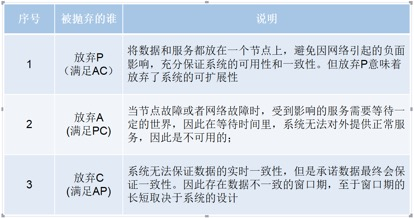

分布式概述

### 分布式系统基础

#### 分布式系统是什么

分布式系统：一个硬件或软件组件分布在不同的网络计算机上，彼此之间仅仅通过消息传递进行通信和协调的系统

 

这是分布式系统，在不同的硬件，不同的软件，不同的网络，不同的计算机上，仅仅通过消息来进行通讯与协调

 

这是他的特点，更细致的看这些特点又可以有：分布性、对等性、并发性、缺乏全局时钟、

故障随时会发生。

 

##### 分布性

既然是分布式系统，最显著的特点肯定就是分布性，从简单来看，如果我们做的是个电商项目，整个项目会分成不同的功能，专业点就不同的微服务，比如用户微服务，产品微服务，订单微服务，这些服务部署在不同的tomcat中，不同的服务器中，甚至不同的集群中，整个架构都是分布在不同的地方的，在空间上是随意的，而且随时会增加，删除服务器节点，这是第一个特性

##### 对等性

对等性是分布式设计的一个目标，还是以电商网站为例，来说明下什么是对等性，要完成一个分布式的系统架构，肯定不是简单的把一个大的单一系统拆分成一个个微服务，然后部署在不同的服务器集群就够了，其中拆分完成的每一个微服务都有可能发现问题，而导致整个电商网站出现功能的丢失。

比如订单服务，为了防止订单服务出现问题，一般情况需要有一个备份，在订单服务出现问题的时候能顶替原来的订单服务。

这就要求这两个（或者2个以上）订单服务完全是对等的，功能完全是一致的，其实这就是一种服务副本的冗余。

还一种是数据副本的冗余，比如数据库，缓存等，都和上面说的订单服务一样，为了安全考虑需要有完全一样的备份存在，这就是对等性的意思。

##### 并发性

并发性其实对我们来说并不模式，在学习多线程的时候已经或多或少学习过，多线程是并发的基础。

但现在我们要接触的不是多线程的角度，而是更高一层，从多进程，多JVM的角度，例如在一个分布式系统中的多个节点，可能会并发地操作一些共享资源，如何准确并高效的协调分布式并发操作。

后面实战部分的分布式锁其实就是解决这问题的。

##### 缺乏全局时钟

在分布式系统中，节点是可能反正任意位置的，而每个位置，每个节点都有自己的时间系统，因此在分布式系统中，很难定义两个事务纠结谁先谁后，原因就是因为缺乏一个全局的时钟序列进行控制，当然，现在这已经不是什么大问题了，已经有大把的时间服务器给系统调用

##### 故障随时会发生

任何一个节点都可能出现停电，死机等现象，服务器集群越多，出现故障的可能性就越大，随着集群数目的增加，出现故障甚至都会成为一种常态，怎么样保证在系统出现故障，而系统还是正常的访问者是作为系统架构师应该考虑的。

 

#### 大型网站架构图回顾

知道什么是分布式系统，接下来具体来看下大型网站架构图，这个图在前面分布式架构演进应该已经讲过，首先整个架构分成很多个层，应用层，服务层，基础设施层与数据服务层，每一层都由若干节点组成，这是典型的分布式架构，后面一大把的时间就是系统的学习里面的每一个部分。

那么zookeeper在其中又是扮演什么角色呢，如果可以把zk扮演成交警的角色，而各个节点就是马路上的各种汽车（汽车，公交车），为了保证整个交通（系统）的可用性，zookeeper必须知道每一节点的健康状态（公交车是否出了问题，要派新的公交【服务注册与发现】），公路在上下班高峰是否拥堵，在某一条很窄的路上只允许单独一个方向的汽车通过【分布式锁】。

如果交通警察是交通系统的指挥官，而zookeeper就是各个节点组成分布式系统的指挥官。

 

#### 分布式系统协调“方法论”

#####  分布式系统带来的问题

如果把分布式系统和平时的交通系统进行对比，哪怕再稳健的交通系统也会有交通事故，分布式系统也有很多需要攻克的问题，比如：通讯异常，网络分区，三态，节点故障等。

###### 通信异常

通讯异常其实就是网络异常，网络系统本身是不可靠的，由于分布式系统需要通过网络进行数据传输，网络光纤，路由器等硬件难免出现问题。只要网络出现问题，也就会影响消息的发送与接受过程，因此数据消息的丢失或者延长就会变得非常普遍。

###### 网络分区

网络分区，其实就是脑裂现象，本来有一个交通警察，来管理整个片区的交通情况，一切井然有序，突然出现了停电，或者出现地震等自然灾难，某些道路接受不到交通警察的指令，可能在这种情况下，会出现一个零时工，片警零时来指挥交通。

 

但注意，原来的交通警察其实还在，只是通讯系统中断了，这时候就会出现问题了，在同一个片区的道路上有不同人在指挥，这样必然引擎交通的阻塞混乱。

 

这种由于种种问题导致同一个区域（分布式集群）有两个相互冲突的负责人的时候就会出现这种精神分裂的情况，在这里称为脑裂，也叫网络分区。

###### 三态

三态是什么？三态其实就是成功，与失败以外的第三种状态，当然，肯定不叫变态，而叫超时态。

在一个jvm中，应用程序调用一个方法函数后会得到一个明确的相应，要么成功，要么失败，而在分布式系统中，虽然绝大多数情况下能够接受到成功或者失败的相应，但一旦网络出现异常，就非常有可能出现超时，当出现这样的超时现象，网络通讯的发起方，是无法确定请求是否成功处理的。

###### 节点故障

这个其实前面已经说过了，节点故障在分布式系统下是比较常见的问题，指的是组成服务器集群的节点会出现的宕机或“僵死”的现象，这种现象经常会发生。

 

##### CAP理论

前面花费了很大的篇幅来了解分布式的特点以及会碰到很多会让人头疼的问题，这些问题肯定会有一定的理论思想来解决问题的。

接下来花点时间来谈谈这些理论，其中CAP和BASE理论是基础，也是面试的时候经常会问到的

首先看下CAP，CAP其实就是一致性，可用性，分区容错性这三个词的缩写

###### 一致性

一致性是事务ACID的一个特性【原子性（Atomicity）、一致性（Consistency）、隔离性（Isolation）、持久性（Durability）】，学习数据库优化的时候deer老师讲过。

这里讲的一致性其实大同小异，只是现在考虑的是分布式环境中，还是不单一的数据库。

在分布式系统中，一致性是数据在多个副本之间是否能够保证一致的特性，这里说的一致性和前面说的对等性其实差不多。如果能够在分布式系统中针对某一个数据项的变更成功执行后，所有用户都可以马上读取到最新的值，那么这样的系统就被认为具有【强一致性】。

###### 可用性

可用性指系统提供服务必须一直处于可用状态，对于用户的操作请求总是能够在有限的时间内访问结果。

这里的重点是【有限的时间】和【返回结果】

为了做到有限的时间需要用到缓存，需要用到负载，这个时候服务器增加的节点是为性能考虑；

为了返回结果，需要考虑服务器主备，当主节点出现问题的时候需要备份的节点能最快的顶替上来，千万不能出现OutOfMemory或者其他500，404错误，否则这样的系统我们会认为是不可用的。

###### 分区容错性

分布式系统在遇到任何网络分区故障的时候，仍然需要能够对外提供满足一致性和可用性的服务，除非是整个网络环境都发生了故障。

不能出现脑裂的情况

###### 具体描述

来看下CAP理论具体描述：

**一个分布式系统不可能同时满足一致性、可用性和分区容错性这三个基本需求，最多只能同时满足其中的两项**



 

TIPS：不可能把所有应用全部放到一个节点上，因此架构师的精力往往就花在怎么样根据业务场景在A和C直接寻求平衡；

##### BASE理论

根据前面的CAP理论，架构师应该从一致性和可用性之间找平衡，系统短时间完全不可用肯定是不允许的，那么根据CAP理论，在分布式环境下必然也无法做到强一致性。

BASE理论：即使无法做到强一致性，但分布式系统可以根据自己的业务特点，采用适当的方式来使系统达到最终的一致性；

###### Basically Avaliable 基本可用

当分布式系统出现不可预见的故障时，允许损失部分可用性，保障系统的“基本可用”；体现在“时间上的损失”和“功能上的损失”；

e.g：部分用户双十一高峰期淘宝页面卡顿或降级处理；

###### Soft state 软状态

其实就是前面讲到的三态,既允许系统中的数据存在中间状态，既系统的不同节点的数据副本之间的数据同步过程存在延时，并认为这种延时不会影响系统可用性；

e.g：12306网站卖火车票，请求会进入排队队列；

###### Eventually consistent 最终一致性

所有的数据在经过一段时间的数据同步后，最终能够达到一个一致的状态；

e.g：理财产品首页充值总金额短时不一致；

##  Zookeeper简介

ZooKeeper致力于提供一个高性能、高可用，且具备严格的顺序访问控制能力的分布式协调服务，是雅虎公司创建，是Google的Chubby一个开源的实现，也是Hadoop和Hbase的重要组件。

### 设计目标

- 简单的数据结构：共享的树形结构，类似文件系统，存储于内存；
- 可以构建集群：避免单点故障，3-5台机器就可以组成集群，超过半数正常工作就能对外提供服务；
- 顺序访问：对于每个读请求，zk会分配一个全局唯一的递增编号，利用这个特性可以实现高级协调服务；
- 高性能：基于内存操作，服务于非事务请求，适用于读操作为主的业务场景。3台zk集群能达到13w QPS；

### 使用场景

数据发布订阅

负载均衡

命名服务

Master选举

集群管理

配置管理

分布式队列

分布式锁

## Zookeeper基础

### 部署

#### Zookeeper windows环境安装

环境要求:必须要有jdk环境,本次讲课使用jdk1.8

1. 安装jdk

2. 安装Zookeeper. 在官网http://zookeeper.apache.org/下载zookeeper.我下载的是zookeeper-3.4.12版本；

   解压zookeeper-3.4.6至D:\machine\zookeeper-3.4.12.

   在D:\machine 新建data及log目录。

3. ZooKeeper的安装模式分为三种，分别为：单机模式（stand-alone）、集群模式和集群伪分布模式。ZooKeeper 单机模式的安装相对比较简单，如果第一次接触ZooKeeper的话，建议安装ZooKeeper单机模式或者集群伪分布模式。

   安装单击模式。 至D:\machine\zookeeper-3.4.12\conf 复制 zoo_sample.cfg 并粘贴到当前目录下，命名zoo.cfg.

#### Linux_Zookeeper集群配置

1.安装jdk运行jdk环境

   上传jdk1.8安装包  

2.安装jdk1.8环境变量

vi /etc/profile     export JAVA_HOME=/usr/local/jdk1.8.0_181  export ZOOKEEPER_HOME=/usr/local/zookeeper  export CLASSPATH=.:$JAVA_HOME/lib/dt.jar:$JAVA_HOME/lib/tools.jar  export  PATH=$JAVA_HOME/bin:$ZOOKEEPER_HOME/bin:$PATH           刷新profile文件  source /etc/profile        关闭防火墙  

 

3.下载zookeeper安装包

  wget https://mirrors.tuna.tsinghua.edu.cn/apache/zookeeper/zookeeper-3.4.10/zookeeper-3.4.10.tar.gz  

 

4.解压Zookeeper安装包

  tar -zxvf zookeeper-3.4.10.tar.gz   

 

5.修改Zookeeper文件夹名称

  重命名： mv zookeeper-3.4.10 zookeeper  

 

6. 修改zoo_sample.cfg文件

  cd /usr/local/zookeeper/conf   mv zoo_sample.cfg zoo.cfg   修改conf: vi zoo.cfg 修改两处   

1. dataDir=/usr/local/zookeeper/data（注意同时在zookeeper创建data目录）   
2. 最后面添加   server.0=192.168.212.154:2888:3888   server.1=192.168.212.156:2888:3888   server.2=192.168.212.157:2888:3888  


7.创建服务器标识
 服务器标识配置：
 创建文件夹： mkdir data
 创建文件myid并填写内容为0： vi
 myid (内容为服务器标识 ： 0)

8.复制zookeeper

进行复制zookeeper目录到node1和node2
 还有/etc/profile文件
 把node1、 node2中的myid文件里的值修改为1和2
 路径(vi /usr/local/zookeeper/data/myid)

9启动zookeeper
 启动zookeeper：
 路径： /usr/local/zookeeper/bin
 执行： zkServer.sh start
 (注意这里3台机器都要进行启动)
 状态： zkServer.sh  status(在三个节点上检验zk的mode,一个leader和俩个follower)

 

scp -r /soft root@zk2:/

scp -r /soft root@zk3:/

 

#### 目录结构

bin       存放系统脚本

conf      存放配置文件

contrib     zk附加功能支持

dist-maven    maven仓库文件

docs      zk文档

lib       依赖的第三方库

recipes     经典场景样例代码

src       zk源码

 

其中bin和conf是非常重要的两个目录，平时也是经常使用的。

 

##### bin目录

先看下bin目录


 

其中

zkServer为服务器，启动后默认端口为2181

zkCli为命令行客户端

 

##### conf目录

Conf目录为配置文件存放的目录，zoo.cfg为核心的配置文件

这里面的配置很多，这配置是运维的工作，目前没必要，也没办法全部掌握。


 

在这挑选几个讲解：

- clientPort：参数无默认值，必须配置，用于配置当前服务器对外的服务端口，客户端必须使用这端口才能进行连接
- dataDir：用于存放内存数据库快照的文件夹，同时用于集群的myid文件也存在这个文件夹里（注意：一个配置文件只能包含一个dataDir字样，即使它被注释掉了。）
- dataLogDir：用于单独设置transaction log的目录，transaction log分离可以避免和普通log还有快照的竞争
- dataDir：新安装zk这文件夹里面是没有文件的，可以通过snapCount参数配置产生快照的时机

以下配置集群中才会使用，后面再讨论

- tickTime：心跳时间，为了确保连接存在的，以毫秒为单位，最小超时时间为两个心跳时间
- initLimit：多少个心跳时间内，允许其他server连接并初始化数据，如果ZooKeeper管理的数据较大，则应相应增大这个值
- syncLimit：多少个tickTime内，允许follower同步，如果follower落后太多，则会被丢弃。

### ZK的特性

Zk的特性会从会话、数据节点，版本，Watcher，ACL权限控制，集群角色这些部分来了解，其中重点需要掌握的数据节点与Watcher

#### 会话

客户端与服务端的一次会话连接，本质是TCP长连接，通过会话可以进行心跳检测和数据传输；

会话（session）是zookepper非常重要的概念，客户端和服务端之间的任何交互操作都与会话有关

 

**会话状态**

看下这图，Zk客户端和服务端成功连接后，就创建了一次会话，ZK会话在整个运行期间的生命周期中，会在不同的会话状态之间切换，这些状态包括：

CONNECTING、CONNECTED、RECONNECTING、RECONNECTED、CLOSE

一旦客户端开始创建Zookeeper对象，那么客户端状态就会变成CONNECTING状态，同时客户端开始尝试连接服务端，连接成功后，客户端状态变为CONNECTED，通常情况下，由于断网或其他原因，客户端与服务端之间会出现断开情况，一旦碰到这种情况，Zookeeper客户端会自动进行重连服务，同时客户端状态再次变成CONNCTING，直到重新连上服务端后，状态又变为CONNECTED，在通常情况下，客户端的状态总是介于CONNECTING和CONNECTED之间。但是，如果出现诸如会话超时、权限检查或是客户端主动退出程序等情况，客户端的状态就会直接变更为CLOSE状态

 

#### ZK数据模型

ZooKeeper的数据结构和标准的Unix文件系统类似，其中每个节点称为“数据节点”或ZNode,每个znode可以存储数据，还可以挂载子节点，因此可以称之为“树”

 

第二点需要注意的是，每一个znode都必须有值，如果没有值，节点是不能创建成功的。

 


 

- 在Zookeeper中，znode是一个跟Unix文件系统路径相似的节点，可以往这个节点存储或获取数据
- 通过客户端可对znode进行增删改查的操作，还可以注册watcher监控znode的变化

 

#### Zookeeper节点类型

节点类型非常重要，是后面项目实战的基础。

 

a、Znode有两种类型：

- 短暂（ephemeral）（create -e /app1/test1 “test1” 客户端断开连接zk删除ephemeral类型节点） 
- 持久（persistent） （create -s /app1/test2 “test2” 客户端断开连接zk不删除persistent类型节点）

b、Znode有四种形式的目录节点（默认是persistent ）

- PERSISTENT 
- PERSISTENT_SEQUENTIAL（持久序列/test0000000019 ）
- EPHEMERAL
- EPHEMERAL_SEQUENTIAL

c、创建znode时设置顺序标识，znode名称后会附加一个值，顺序号是一个单调递增的计数器，由父节点维护 

d、在分布式系统中，顺序号可以被用于为所有的事件进行全局排序，这样客户端可以通过顺序号推断事件的顺序

 

#### Zookeeper节点状态属性


 

#### ACL保障数据的安全

ACL机制，表示为scheme:id:permissions，第一个字段表示采用哪一种机制，第二个id表示用户，permissions表示相关权限（如只读，读写，管理等）。

 

zookeeper提供了如下几种机制（scheme）：

**world:** 它下面只有一个id, 叫anyone, world:anyone代表任何人，zookeeper中对所有人有权限的结点就是属于world:anyone的

**auth:** 它不需要id, 只要是通过authentication的user都有权限（zookeeper支持通过kerberos来进行authencation, 也支持username/password形式的authentication)

**digest:** 它对应的id为username:BASE64(SHA1(password))，它需要先通过username:password形式的authentication

**ip:** 它对应的id为客户机的IP地址，设置的时候可以设置一个ip段，比如ip:192.168.1.0/16, 表示匹配前16个bit的IP段

 

#### 命令行

##### 服务端常用命令

在准备好相应的配置之后，可以直接通过zkServer.sh 这个脚本进行服务的相关操作 

启动ZK服务:    sh bin/zkServer.sh start 

查看ZK服务状态: sh bin/zkServer.sh status 

停止ZK服务:    sh bin/zkServer.sh stop  

重启ZK服务:    sh bin/zkServer.sh restart 

##### 客户端常用命令

使用 zkCli.sh -server 127.0.0.1:2181 连接到 ZooKeeper 服务，连接成功后，系统会输出 ZooKeeper 的相关环境以及配置信息。 命令行工具的一些简单操作如下：


- 显示根目录下、文件： ls / 使用 ls 命令来查看当前 ZooKeeper 中所包含的内容 

- 显示根目录下、文件： ls2 / 查看当前节点数据并能看到更新次数等数据 

- 创建文件，并设置初始内容： create /zk "test" 创建一个新的 znode节点“ zk ”以及与它关联的字符串 [-e] [-s] 【-e 零时节点】 【-s 顺序节点】

- 获取文件内容： get /zk 确认 znode 是否包含我们所创建的字符串 [watch]【watch 监听】

- 修改文件内容： set /zk "zkbak" 对 zk 所关联的字符串进行设置

- 删除文件： delete /zk 将刚才创建的 znode 删除，如果存在子节点删除失败 

- 递归删除：rmr /zk将刚才创建的 znode 删除，子节点同时删除

- 退出客户端： quit

- 帮助命令： help

  

##### ACL命令常用命令

再回过头来看下ACL权限

Zookeeper的ACL(Access Control List)，分为三个维度：scheme、id、permission

通常表示为：scheme: id:permission

-  schema:代表授权策略
- id:代表用户
- permission:代表权限

 

###### Scheme

- world：默认方式，相当于全世界都能访问
- auth：代表已经认证通过的用户(可以通过addauth digest user:pwd 来添加授权用户)
- digest：即用户名:密码这种方式认证，这也是业务系统中最常用的
- ip：使用Ip地址认证

 

###### id

id是验证模式，不同的scheme，id的值也不一样。

- scheme为auth时：username:password
- scheme为digest时:username:BASE64(SHA1(password))
- scheme为ip时:客户端的ip地址。
- scheme为world时  anyone。

###### Permission

CREATE、READ、WRITE、DELETE、ADMIN 也就是 增、删、改、查、管理权限，这5种权限简写为crwda(即：每个单词的首字符缩写)

CREATE(c)：创建子节点的权限

DELETE(d)：删除节点的权限

READ(r)：读取节点数据的权限

WRITE(w)：修改节点数据的权限

ADMIN(a)：设置子节点权限的权限

###### ACL命令

1. getAcl

   获取指定节点的ACL信息

   create /testDir/testAcl deer # 创建一个子节点

   getAcl /testDir/testAcl   # 获取该节点的acl权限信息

2. setAcl 设置指定节点的ACL信息

   ```
   setAcl /testDir/testAcl world:anyone:crwa  # 设置该节点的acl权限
   
   getAcl /testDir/testAcl  # 获取该节点的acl权限信息，成功后，该节点就少了d权限
   
   create /testDir/testAcl/xyz xyz-data  # 创建子节点
   
   delete /testDir/testAcl/xyz  # 由于没有d权限，所以提示无法删除
   ```

3. addauth 注册会话授权信息

   ```
   addauth digest user1:123456        # 需要先添加一个用户
   setAcl /testDir/testAcl auth:user1:123456:crwa  # 然后才可以拿着这个用户去设置权限
   getAcl /testDir/testAcl  # 密码是以密文的形式存储的
   create /testDir/testAcl/testa aaa  
   delete /testDir/testAcl/testa  # 由于没有d权限，所以提示无法删除
   退出客户端后：
   ls /testDir/testAcl # 没有权限无法访问
   create /testDir/testAcl/testb bbb # 没有权限无法访问
   addauth digest user1:123456 # 重新新增权限后可以访问了
   ```

   

4. Digest

   auth与digest的区别就是，前者使用明文密码进行登录，后者使用密文密码进行登录

   create /testDir/testDigest data

   addauth digest user1:123456

   setAcl /testDir/testDigest digest:user1:HYGa7IZRm2PUBFiFFu8xY2pPP/s=:crwa  # 使用digest来设置权限

   注意：这里如果使用明文，会导致该znode不可访问

   

   **通过明文获得密文**

   ```sh
   shell> 
   
   java -Djava.ext.dirs=/soft/zookeeper-3.4.12/lib -cp /soft/zookeeper-3.4.12/zookeeper-3.4.12.jar org.apache.zookeeper.server.auth.DigestAuthenticationProvider deer:123456
   
   deer:123456->deer:ACFm5rWnnKn9K9RN/Oc8qEYGYDs=
   
    
   ```

5. acl命令行ip

   ```
   create /testDir/testIp data
   
   setAcl /testDir/testIp ip:192.168.30.10:cdrwa
   
   getAcl  /testDir/testIp
   ```

6. ACL权限补充

    很多同学练习setAcl权限的时候由于失误，导致节点无法删除

    create /enjoy1/node1 enjoy

    setAcl /enjoy1  world:anyone:r

    这个时候无论是delete 还是rmr都没有权限删除

    

    **解决方式:启用super权限**

   ```
      使用DigestAuthenticationProvider.generateDigest("super:admin"); 获得密码
   ```

   **1.**      **修改zkServer启动脚本增加**

   "-Dzookeeper.DigestAuthenticationProvider.superDigest=super:xQJmxLMiHGwaqBvst5y6rkB6HQs="

   **2.**      **启动客户端用管理员登陆**

     addauth digest super:admin

##### 常用四字命令

ZooKeeper 支持某些特定的四字命令字母与其的交互。用来获取 ZooKeeper 服务的当前状态及相关信息。可通过 telnet 或 nc 向 ZooKeeper 提交相应的命令 ：

当然，前提是安装好了nc

```
yum install nc
```

-  echo stat|nc 127.0.0.1 2181 来查看哪个节点被选择作为follower或者leader 
- echo ruok|nc 127.0.0.1 2181 测试是否启动了该Server，若回复imok表示已经启动。
- echo dump| nc 127.0.0.1 2181 ,列出未经处理的会话和临时节点。 
- echo kill | nc 127.0.0.1 2181 ,关掉server 
- echo conf | nc 127.0.0.1 2181 ,输出相关服务配置的详细信息
- echo cons | nc 127.0.0.1 2181 ,列出所有连接到服务器的客户端的完全的连接 / 会话的详细信息 
- echo envi |nc 127.0.0.1 2181 ,输出关于服务环境的详细信息（区别于 conf 命令）
- echo reqs | nc 127.0.0.1 2181 ,列出未经处理的请求
- echo wchs | nc 127.0.0.1 2181 ,列出服务器 watch 的详细信息
- echo wchc | nc 127.0.0.1 2181 ,通过 session 列出服务器 watch 的详细信息，它的输出是一个与 watch 相关的会话的列表
- echo wchp | nc 127.0.0.1 2181 ,通过路径列出服务器 watch 的详细信息。它输出一个与 session 相关的路径

 

##### ZooKeeper 日志可视化

前面以及讲了两个非常重要的配置一个是dataDir，存放的快照数据，一个是dataLogDir，存放的是事务日志文件

```sh
java -cp /soft/zookeeper-3.4.12/zookeeper-3.4.12.jar:/soft/zookeeper-3.4.12/lib/slf4j-api-1.7.25.jar org.apache.zookeeper.server.LogFormatter log.1

java -cp /soft/zookeeper-3.4.12/zookeeper-3.4.12.jar:/soft/zookeeper-3.4.12/lib/slf4j-api-1.7.25.jar org.apache.zookeeper.server.SnapshotFormatter log.1
```

### Java客户端框架

#### Zookeeper原生客户端

```xml
<?xml version="1.0" encoding="UTF-8"?>

<project xmlns="http://maven.apache.org/POM/4.0.0"

     xmlns:xsi="http://www.w3.org/2001/XMLSchema-instance"

     xsi:schemaLocation="http://maven.apache.org/POM/4.0.0 http://maven.apache.org/xsd/maven-4.0.0.xsd">

  <modelVersion>4.0.0</modelVersion>


  <groupId>enjoy</groupId>

  <artifactId>zookeeperJavaApi</artifactId>

  <version>1.0-SNAPSHOT</version>

 

<dependencies>

  <dependency>

    <groupId>junit</groupId>

    <artifactId>junit</artifactId>

    <version>4.12</version>

  </dependency>

  <dependency>

    <groupId>org.apache.zookeeper</groupId>

    <artifactId>zookeeper</artifactId>

    <version>3.4.12</version>

  </dependency>

  <dependency>

    <groupId>com.101tec</groupId>

    <artifactId>zkclient</artifactId>

    <version>0.10</version>

  </dependency>

 

  <dependency>

    <groupId>org.apache.curator</groupId>

    <artifactId>curator-framework</artifactId>

    <version>4.0.0</version>

  </dependency>

  <dependency>

    <groupId>org.apache.curator</groupId>

    <artifactId>curator-recipes</artifactId>

    <version>4.0.0</version>

  </dependency>

</dependencies>

  <build>

    <plugins>

      <plugin>

        <groupId>org.apache.maven.plugins</groupId>

        <artifactId>maven-compiler-plugin</artifactId>

        <configuration>

          <source>1.8</source>

          <target>1.8</target>

        </configuration>

      </plugin>

    </plugins>

  </build>

 

</project>
```

 

 

####  创建会话

```java
package cn.enjoy.javaapi;
import org.apache.zookeeper.WatchedEvent;
import org.apache.zookeeper.Watcher;
import org.apache.zookeeper.ZooKeeper;
import org.junit.Test;
import java.util.concurrent.CountDownLatch;
 

/**
 \* Created by VULCAN on 2018/11/5.
 */

public class TestCreateSession {

  //ZooKeeper服务地址
  private static final String SERVER = "192.168.30.10:2181";
 
  //会话超时时间
  private final int SESSION_TIMEOUT = 30000;

  @Test
  /**
   \* 获得session的方式，这种方式可能会在ZooKeeper还没有获得连接的时候就已经对ZK进行访问了
   */

  public void testSession1() throws Exception {
    ZooKeeper zooKeeper = new ZooKeeper(SERVER,SESSION_TIMEOUT,null);
    System.out.println(zooKeeper);
    System.out.println(zooKeeper.getState());
  }

  //发令枪
  private CountDownLatch countDownLatch = new CountDownLatch(1);

  @Test
  /**
   \* 对获得Session的方式进行优化，在ZooKeeper初始化完成以前先等待，等待完成后再进行后续操作
   */
  public void testSession2() throws Exception {

    ZooKeeper zooKeeper = new ZooKeeper(SERVER, SESSION_TIMEOUT, new Watcher() {
      @Override
      public void process(WatchedEvent watchedEvent) {
        if(watchedEvent.getState() == Event.KeeperState.SyncConnected) {
          //确认已经连接完毕后再进行操作
          countDownLatch.countDown();
          System.out.println("已经获得了连接");
        }
      }
    });

    //连接完成之前先等待
    countDownLatch.await();
    System.out.println(zooKeeper.getState());
  }
}

```

 

#### 客户端基本操作

```java
package cn.enjoy.javaapi;

import org.apache.zookeeper.*;
import java.io.IOException;
import java.util.concurrent.CountDownLatch;

public class TestJavaApi implements Watcher {

  private static final int SESSION_TIMEOUT = 10000;
  private static final String CONNECTION_STRING = "192.168.30.10:2181";
  private static final String ZK_PATH = "/leader";
  private ZooKeeper zk = null;
  private CountDownLatch connectedSemaphore = new CountDownLatch(1);


  /**
   \* 创建ZK连接
   *
   \* @param connectString ZK服务器地址列表
   \* @param sessionTimeout Session超时时间
   */

  public void createConnection(String connectString, int sessionTimeout) {

    this.releaseConnection();
    try {
      zk = new ZooKeeper(connectString, sessionTimeout, this);
      connectedSemaphore.await();
    } catch (InterruptedException e) {
      System.out.println("连接创建失败，发生 InterruptedException");
      e.printStackTrace()
    } catch (IOException e) {
      System.out.println("连接创建失败，发生 IOException");
      e.printStackTrace();
    }
  }

  /**
   \* 关闭ZK连接
   */

  public void releaseConnection() {
    if (null != this.zk) {
      try {
        this.zk.close();
      } catch (InterruptedException e) {
        // ignore
        e.printStackTrace();
      }
    }
  }

  /**
   \* 创建节点
   \*
   \* @param path 节点path
   \* @param data 初始数据内容
   \* @return
   */

  public boolean createPath(String path, String data) {

    try {
      System.out.println("节点创建成功, Path: "
         \+ this.zk.create(path, // 节点路径
          data.getBytes(), // 节点内容
          ZooDefs.Ids.OPEN_ACL_UNSAFE, //节点权限
          CreateMode.EPHEMERAL) //节点类型
          \+ ", content: " + data);
    } catch (KeeperException e) {
      System.out.println("节点创建失败，发生KeeperException");
      e.printStackTrace();
    } catch (InterruptedException e) {
      System.out.println("节点创建失败，发生 InterruptedException");
      e.printStackTrace();
    }
    return true;
  }

 

  /**
   \* 读取指定节点数据内容
   \* @param path 节点path
   \* @return
   */

  public String readData(String path) {

    try {
      System.out.println("获取数据成功，path：" + path);
      return new String(this.zk.getData(path, false, null));
    } catch (KeeperException e) {
      System.out.println("读取数据失败，发生KeeperException，path: " + path);
      e.printStackTrace();
      return "";
    } catch (InterruptedException e) {
      System.out.println("读取数据失败，发生 InterruptedException，path: " + path);
      e.printStackTrace();
      return "";
    }
  }

 

  /**
   \* 更新指定节点数据内容
   \* @param path 节点path
   \* @param data 数据内容
   \* @return
   */

  public boolean writeData(String path, String data) {

    try {
      System.out.println("更新数据成功，path：" + path + ", stat: " +
          this.zk.setData(path, data.getBytes(), -1));
    } catch (KeeperException e) {
      System.out.println("更新数据失败，发生KeeperException，path: " + path);
      e.printStackTrace();
    } catch (InterruptedException e) {
      System.out.println("更新数据失败，发生 InterruptedException，path: " + path);
      e.printStackTrace();
    }
    return false;
  }

 

  /**
   \* 删除指定节点
   \* @param path 节点path
   */

  public void deleteNode(String path) {
    try {
      this.zk.delete(path, -1);
      System.out.println("删除节点成功，path：" + path);
    } catch (KeeperException e) {
      System.out.println("删除节点失败，发生KeeperException，path: " + path);
      e.printStackTrace();
    } catch (InterruptedException e) {
      System.out.println("删除节点失败，发生 InterruptedException，path: " + path);
      e.printStackTrace();
    }
  }

 

  public static void main(String[] args) {

    TestJavaApi sample = new TestJavaApi();
    sample.createConnection(CONNECTION_STRING, SESSION_TIMEOUT);
    if (sample.createPath(ZK_PATH, "我是节点初始内容")) {
      System.out.println();
      System.out.println("数据内容: " + sample.readData(ZK_PATH) + "\n");
      sample.writeData(ZK_PATH, "更新后的数据");
      System.out.println("数据内容: " + sample.readData(ZK_PATH) + "\n");
      sample.deleteNode(ZK_PATH);
    }
    sample.releaseConnection();
  }

 

  /**
   \* 收到来自Server的Watcher通知后的处理。
   */

  @Override
  public void process(WatchedEvent event) {
    System.out.println("收到事件通知：" + event.getState() + "\n");
    if (Event.KeeperState.SyncConnected == event.getState()) {
      connectedSemaphore.countDown();
    } 
  }
}

 
```


####  Watch机制

```java
package cn.enjoy.javaapi;
import org.apache.zookeeper.*;
import org.apache.zookeeper.data.Stat;
import java.util.List;
import java.util.concurrent.CountDownLatch;
import java.util.concurrent.atomic.AtomicInteger; 

public class ZooKeeperWatcher implements Watcher {

 
  /** 定义原子变量 */
  AtomicInteger seq = new AtomicInteger();

  /** 定义session失效时间 */
  private static final int SESSION_TIMEOUT = 10000;

  /** zookeeper服务器地址 */
  private static final String CONNECTION_ADDR = "192.168.30.10:2181";

  /** zk父路径设置 */
  private static final String PARENT_PATH = "/testWatch";

  /** zk子路径设置 */
  private static final String CHILDREN_PATH = "/testWatch/children";

  /** 进入标识 */
  private static final String LOG_PREFIX_OF_MAIN = "【Main】";

  /** zk变量 */
  private ZooKeeper zk = null;

  /** 信号量设置，用于等待zookeeper连接建立之后 通知阻塞程序继续向下执行 */
  private CountDownLatch connectedSemaphore = new CountDownLatch(1);

 

  /**
   \* 创建ZK连接
   \* @param connectAddr ZK服务器地址列表
   \* @param sessionTimeout Session超时时间
   */

  public void createConnection(String connectAddr, int sessionTimeout) {

    this.releaseConnection();
    try {
      zk = new ZooKeeper(connectAddr, sessionTimeout, this);
      System.out.println(LOG_PREFIX_OF_MAIN + "开始连接ZK服务器");
      connectedSemaphore.await();
    } catch (Exception e) {
      e.printStackTrace();
    }
  }

 

  /**
   \* 关闭ZK连接
   */

  public void releaseConnection() {

    if (this.zk != null) {
      try {
        this.zk.close();
      } catch (InterruptedException e) {
        e.printStackTrace();
      }
    }
  }

 

  /**
   \* 创建节点
   \* @param path 节点路径
   \* @param data 数据内容
   \* @return
   */

  public boolean createPath(String path, String data) {

    try {
      //设置监控(由于zookeeper的监控都是一次性的所以 每次必须设置监控)
      this.zk.exists(path, true);
      System.out.println(LOG_PREFIX_OF_MAIN + "节点创建成功, Path: " +
          this.zk.create( /**路径*/
              path,
              /**数据*/
              data.getBytes(),
              /**所有可见*/
              ZooDefs.Ids.OPEN_ACL_UNSAFE,
              /**永久存储*/
              CreateMode.PERSISTENT ) +
          ", content: " + data);

    } catch (Exception e) {
      e.printStackTrace();
      return false;
    }
    return true;
  }

 

  /**
   \* 读取指定节点数据内容
   \* @param path 节点路径
   \* @return
   */

  public String readData(String path, boolean needWatch) {

    try {
      return new String(this.zk.getData(path, needWatch, null));
    } catch (Exception e) {
      e.printStackTrace();
      return "";
    }

  }

 

  /**
   \* 更新指定节点数据内容
   \* @param path 节点路径
   \* @param data 数据内容
   \* @return
   */

  public boolean writeData(String path, String data) {

    try {
      System.out.println(LOG_PREFIX_OF_MAIN + "更新数据成功，path：" + path + ", stat: " +
          this.zk.setData(path, data.getBytes(), -1));
    } catch (Exception e) {
      e.printStackTrace();
    }

    return false;
  }

 

  /**
   \* 删除指定节点
   \* @param path
   \*      节点path
   */

  public void deleteNode(String path) {

    try {
      this.zk.delete(path, -1);
      System.out.println(LOG_PREFIX_OF_MAIN + "删除节点成功，path：" + path);
    } catch (Exception e) {
      e.printStackTrace();
    }

  }

 

  /**
   \* 判断指定节点是否存在
   \* @param path 节点路径
   */

  public Stat exists(String path, boolean needWatch) {

    try {
      return this.zk.exists(path, needWatch);
    } catch (Exception e) {
      e.printStackTrace();
      return null;
    }
  }

 

  /**
   \* 获取子节点
   \* @param path 节点路径
   */

  private List<String> getChildren(String path, boolean needWatch) {

    try {
      return this.zk.getChildren(path, needWatch);
    } catch (Exception e) {
      e.printStackTrace();
      return null;
    }
  }

 

  /**
   \* 删除所有节点
   */

  public void deleteAllTestPath() {

    if(this.exists(CHILDREN_PATH, false) != null){
      this.deleteNode(CHILDREN_PATH);
    }
    if(this.exists(PARENT_PATH, false) != null){
      this.deleteNode(PARENT_PATH);
    }

  }

 

  /**
   \* 收到来自Server的Watcher通知后的处理。
   */

  @Override

  public void process(WatchedEvent event) {

    System.out.println("进入 process 。。。。。event = " + event);
    try {
      Thread.sleep(200);
    } catch (InterruptedException e) {
      e.printStackTrace();
    }

 
    if (event == null) {
      return;
    }

    // 连接状态
    Watcher.Event.KeeperState keeperState = event.getState();
    // 事件类型
    Watcher.Event.EventType eventType = event.getType();
    // 受影响的path
    String path = event.getPath();
    String logPrefix = "【Watcher-" + this.seq.incrementAndGet() + "】";
    System.out.println(logPrefix + "收到Watcher通知");
    System.out.println(logPrefix + "连接状态:\t" + keeperState.toString());
    System.out.println(logPrefix + "事件类型:\t" + eventType.toString());

      // 成功连接上ZK服务器
      if (Event.EventType.None == eventType) {
        System.out.println(logPrefix + "成功连接上ZK服务器");
        connectedSemaphore.countDown();
      }

      //创建节点

      else if (Event.EventType.NodeCreated == eventType) {
        System.out.println(logPrefix + "节点创建");
        try {
         Thread.sleep(100);
        } catch (InterruptedException e) {
          e.printStackTrace();
        }
        this.exists(path, true);
      }

      //更新节点
       else if (Event.EventType.NodeDataChanged == eventType) {
        System.out.println(logPrefix + "节点数据更新");
        try {
          Thread.sleep(100);
        } catch (InterruptedException e) {
          e.printStackTrace();
        }

        System.out.println(logPrefix + "数据内容: " + this.readData(PARENT_PATH, true));
      }

     //更新子节点
      else if (Event.EventType.NodeChildrenChanged == eventType) {
        System.out.println(logPrefix + "子节点变更");
       try {
          Thread.sleep(3000);
        } catch (InterruptedException e) {
           e.printStackTrace();
        }

        System.out.println(logPrefix + "子节点列表：" + this.getChildren(PARENT_PATH, true));
      }
      //删除节点
      else if (Event.EventType.NodeDeleted == eventType) {
        System.out.println(logPrefix + "节点 " + path + " 被删除");
      }
    } else if (Watcher.Event.KeeperState.Disconnected == keeperState) {
      System.out.println(logPrefix + "与ZK服务器断开连接");
    } else if (Watcher.Event.KeeperState.AuthFailed == keeperState) {
      System.out.println(logPrefix + "权限检查失败");
 } else if (Watcher.Event.KeeperState.Expired == keeperState) {
      System.out.println(logPrefix + "会话失效");
    }
    System.out.println("--------------------------------------------");
  }

  public static void main(String[] args) throws Exception {
    //建立watcher
    ZooKeeperWatcher zkWatch = new ZooKeeperWatcher();
    //创建连接
    zkWatch.createConnection(CONNECTION_ADDR, SESSION_TIMEOUT);
    //System.out.println(zkWatch.zk.toString());
    Thread.sleep(1000);
    // 清理节点
    zkWatch.deleteAllTestPath();
    if (zkWatch.createPath(PARENT_PATH, System.currentTimeMillis() + "")) {
      // 读取数据，在操作节点数据之前先调用zookeeper的getData()方法是为了可以watch到对节点的操作。watch是一次性的，
      // 也就是说，如果第二次又重新调用了setData()方法，在此之前需要重新调用一次。
       System.out.println("---------------------- read parent ----------------------------");
      zkWatch.readData(PARENT_PATH, true);
      // 更新数据
      zkWatch.writeData(PARENT_PATH, System.currentTimeMillis() + "");
      /** 读取子节点，设置对子节点变化的watch，如果不写该方法，则在创建子节点是只会输出NodeCreated，而不会输出NodeChildrenChanged，
       也就是说创建子节点时没有watch。
       如果是递归的创建子节点，如path="/p/c1/c2"的话，getChildren(PARENT_PATH, ture)只会在创建c1时watch，输出c1的NodeChildrenChanged，
       而不会输出创建c2时的NodeChildrenChanged，如果watch到c2的NodeChildrenChanged，则需要再调用一次getChildren(String path, true)方法，
       其中path="/p/c1"
       */

      System.out.println("---------------------- read children path ----------------------------");

      zkWatch.getChildren(PARENT_PATH, true);
      Thread.sleep(1000); 
      // 创建子节点，同理如果想要watch到NodeChildrenChanged状态，需要调用getChildren(CHILDREN_PATH, true)
      zkWatch.createPath(CHILDREN_PATH, System.currentTimeMillis() + ""); 
       Thread.sleep(1000);
      zkWatch.readData(CHILDREN_PATH, true);
      zkWatch.writeData(CHILDREN_PATH, System.currentTimeMillis() + "");
    }

    Thread.sleep(50000);
    // 清理节点
    zkWatch.deleteAllTestPath();
    Thread.sleep(1000);
    zkWatch.releaseConnection();
  }

}

 
```

 

#### ZK认证机制

```java
package cn.enjoy.javaapi;
import org.apache.zookeeper.Watcher;
import org.apache.zookeeper.*;
import org.apache.zookeeper.data.ACL;
import org.apache.zookeeper.data.Stat;
import java.util.ArrayList;
import java.util.List;
import java.util.concurrent.CountDownLatch;
import java.util.concurrent.atomic.AtomicInteger;

public class TestZookeeperAuth implements Watcher {

 

  /** 连接地址 */
  final static String CONNECT_ADDR = "192.168.30.10:2181";
  /** 测试路径 */
  final static String PATH = "/testAuth";
  final static String PATH_DEL = "/testAuth/delNode";
  /** 认证类型 */
  final static String authentication_type = "digest";
  /** 认证正确方法 */
  final static String correctAuthentication = "123456";
  /** 认证错误方法 */
  final static String badAuthentication = "654321";

  static ZooKeeper zk = null;
  /** 计时器 */
  AtomicInteger seq = new AtomicInteger();
  /** 标识 */
  private static final String LOG_PREFIX_OF_MAIN = "【Main】";
  private CountDownLatch connectedSemaphore = new CountDownLatch(1);

  @Override
  public void process(WatchedEvent event) {
    try {
      Thread.sleep(200);
    } catch (InterruptedException e) {
      e.printStackTrace();
    }
    if (event==null) {
      return;
    }
    // 连接状态
    Event.KeeperState keeperState = event.getState();
    // 事件类型
    Event.EventType eventType = event.getType();
    // 受影响的path
    String path = event.getPath();

    String logPrefix = "【Watcher-" + this.seq.incrementAndGet() + "】";
    System.out.println(logPrefix + "收到Watcher通知");
    System.out.println(logPrefix + "连接状态:\t" + keeperState.toString());
    System.out.println(logPrefix + "事件类型:\t" + eventType.toString());
    if (Event.KeeperState.SyncConnected == keeperState) {
      // 成功连接上ZK服务器
      if (Event.EventType.None == eventType) {
        System.out.println(logPrefix + "成功连接上ZK服务器");
        connectedSemaphore.countDown();
      }

    } else if (Event.KeeperState.Disconnected == keeperState) {
      System.out.println(logPrefix + "与ZK服务器断开连接");
    } else if (Event.KeeperState.AuthFailed == keeperState) {
      System.out.println(logPrefix + "权限检查失败");
    } else if (Event.KeeperState.Expired == keeperState) {
      System.out.println(logPrefix + "会话失效");
    }
    System.out.println("--------------------------------------------");
  }

  /**
   \* 创建ZK连接
   \* @param connectString
   \*      ZK服务器地址列表
   \* @param sessionTimeout
   \*      Session超时时间
   */

  public void createConnection(String connectString, int sessionTimeout) {

    this.releaseConnection();
    try {
      zk = new ZooKeeper(connectString, sessionTimeout, this);
      //添加节点授权
      zk.addAuthInfo(authentication_type,correctAuthentication.getBytes());
      System.out.println(LOG_PREFIX_OF_MAIN + "开始连接ZK服务器");
      //倒数等待
      connectedSemaphore.await();
    } catch (Exception e) {
      e.printStackTrace();
    }
  }

 

  /**

   \* 关闭ZK连接

   */

  public void releaseConnection() {

    if (this.zk!=null) {
      try {
        this.zk.close();
      } catch (InterruptedException e) {
      }

    }

  }

 

  /**
   \* @param args
   \* @throws Exception
   */

  public static void main(String[] args) throws Exception {

    TestZookeeperAuth testAuth = new TestZookeeperAuth();
    testAuth.createConnection(CONNECT_ADDR,2000);

    List<ACL> acls = new ArrayList<ACL>(1);
   for (ACL ids_acl : ZooDefs.Ids.CREATOR_ALL_ACL) {
      acls.add(ids_acl);
    }

    try {
      zk.create(PATH, "init content".getBytes(), acls, CreateMode.PERSISTENT);
      System.out.println("使用授权key：" + correctAuthentication + "创建节点："+ PATH + ", 初始内容是: init content");
    } catch (Exception e) {
      e.printStackTrace();
    }

    try {
      zk.create(PATH_DEL, "will be deleted! ".getBytes(), acls, CreateMode.PERSISTENT);
      System.out.println("使用授权key：" + correctAuthentication + "创建节点："+ PATH_DEL + ", 初始内容是: init content");
    } catch (Exception e) {
      e.printStackTrace();
    }

 

    // 获取数据

    getDataByNoAuthentication();
    getDataByBadAuthentication();
    getDataByCorrectAuthentication();

    // 更新数据
    updateDataByNoAuthentication();
    updateDataByBadAuthentication();
    updateDataByCorrectAuthentication();

    // 删除数据
    deleteNodeByBadAuthentication();
    deleteNodeByNoAuthentication();
    deleteNodeByCorrectAuthentication();
    //
    Thread.sleep(1000);

    deleteParent();
    //释放连接
    testAuth.releaseConnection();

  }

  /** 获取数据：采用错误的密码 */
  static void getDataByBadAuthentication() {
    String prefix = "[使用错误的授权信息]";
    try {
      ZooKeeper badzk = new ZooKeeper(CONNECT_ADDR, 2000, null);
      //授权
      badzk.addAuthInfo(authentication_type,badAuthentication.getBytes());
      Thread.sleep(2000);
      System.out.println(prefix + "获取数据：" + PATH);
      System.out.println(prefix + "成功获取数据：" + badzk.getData(PATH, false, null));
    } catch (Exception e) {
      System.err.println(prefix + "获取数据失败，原因：" + e.getMessage());
    }

  }

 

  /** 获取数据：不采用密码 */

  static void getDataByNoAuthentication() {

    String prefix = "[不使用任何授权信息]";
    try {
      System.out.println(prefix + "获取数据：" + PATH);
      ZooKeeper nozk = new ZooKeeper(CONNECT_ADDR, 2000, null);
      Thread.sleep(2000);
      System.out.println(prefix + "成功获取数据：" + nozk.getData(PATH, false, null));
    } catch (Exception e) {
      System.err.println(prefix + "获取数据失败，原因：" + e.getMessage());
    }

  }

 

  /** 采用正确的密码 */

  static void getDataByCorrectAuthentication() {

    String prefix = "[使用正确的授权信息]";
    try {
      System.out.println(prefix + "获取数据：" + PATH);
      System.out.println(prefix + "成功获取数据：" + zk.getData(PATH, false, null));
    } catch (Exception e) {
      System.out.println(prefix + "获取数据失败，原因：" + e.getMessage());
    }
  }

 

  /**
   \* 更新数据：不采用密码
   */

  static void updateDataByNoAuthentication() {

    String prefix = "[不使用任何授权信息]";
 
    System.out.println(prefix + "更新数据： " + PATH);
    try {

      ZooKeeper nozk = new ZooKeeper(CONNECT_ADDR, 2000, null);
      Thread.sleep(2000);
      Stat stat = nozk.exists(PATH, false);
      if (stat!=null) {
        nozk.setData(PATH, prefix.getBytes(), -1);
        System.out.println(prefix + "更新成功");
      }

     } catch (Exception e) {
      System.err.println(prefix + "更新失败，原因是：" + e.getMessage());
    }

  }

 

  /**
   \* 更新数据：采用错误的密码
   */

  static void updateDataByBadAuthentication() {

    String prefix = "[使用错误的授权信息]";
    System.out.println(prefix + "更新数据：" + PATH);

    try {
      ZooKeeper badzk = new ZooKeeper(CONNECT_ADDR, 2000, null);
      //授权
      badzk.addAuthInfo(authentication_type,badAuthentication.getBytes());
      Thread.sleep(2000);
      Stat stat = badzk.exists(PATH, false);
      if (stat!=null) {

        badzk.setData(PATH, prefix.getBytes(), -1);
        System.out.println(prefix + "更新成功");
      }
    } catch (Exception e) {
      System.err.println(prefix + "更新失败，原因是：" + e.getMessage());
    }

  }

 

  /**
   \* 更新数据：采用正确的密码
   */

  static void updateDataByCorrectAuthentication() {

    String prefix = "[使用正确的授权信息]";
    System.out.println(prefix + "更新数据：" + PATH);
    try {
      Stat stat = zk.exists(PATH, false);
      if (stat!=null) {
        zk.setData(PATH, prefix.getBytes(), -1);
        System.out.println(prefix + "更新成功");
      }
    } catch (Exception e) {
      System.err.println(prefix + "更新失败，原因是：" + e.getMessage());
    }

  }

 

  /**

   \* 不使用密码 删除节点

   */

  static void deleteNodeByNoAuthentication() throws Exception {

    String prefix = "[不使用任何授权信息]";

    try {
      System.out.println(prefix + "删除节点：" + PATH_DEL);
      ZooKeeper nozk = new ZooKeeper(CONNECT_ADDR, 2000, null);
      Thread.sleep(2000);
     Stat stat = nozk.exists(PATH_DEL, false);
      if (stat!=null) {
        nozk.delete(PATH_DEL,-1);
        System.out.println(prefix + "删除成功");
      }
    } catch (Exception e) {
      System.err.println(prefix + "删除失败，原因是：" + e.getMessage());
    }
  }

 

  /**

   \* 采用错误的密码删除节点

   */

  static void deleteNodeByBadAuthentication() throws Exception {

    String prefix = "[使用错误的授权信息]";

    try {
      System.out.println(prefix + "删除节点：" + PATH_DEL);
      ZooKeeper badzk = new ZooKeeper(CONNECT_ADDR, 2000, null);
      //授权
      badzk.addAuthInfo(authentication_type,badAuthentication.getBytes());
      Thread.sleep(2000);
      Stat stat = badzk.exists(PATH_DEL, false);
      if (stat!=null) {
        badzk.delete(PATH_DEL, -1);
        System.out.println(prefix + "删除成功");
      }
    } catch (Exception e) {
      System.err.println(prefix + "删除失败，原因是：" + e.getMessage());
    }

  }

 

  /**
   \* 使用正确的密码删除节点
   */

  static void deleteNodeByCorrectAuthentication() throws Exception {

    String prefix = "[使用正确的授权信息]";

    try {
      System.out.println(prefix + "删除节点：" + PATH_DEL);
      Stat stat = zk.exists(PATH_DEL, false);
      if (stat!=null) {
        zk.delete(PATH_DEL, -1);
        System.out.println(prefix + "删除成功");
      }

    } catch (Exception e) {
      System.out.println(prefix + "删除失败，原因是：" + e.getMessage());
    }
  }

  /**
   \* 使用正确的密码删除节点
   */

  static void deleteParent() throws Exception {

    try {

      Stat stat = zk.exists(PATH_DEL, false);
      if (stat == null) {
        zk.delete(PATH, -1);
      }
    } catch (Exception e) {
      e.printStackTrace();
    }
  } 

}

 
```

 

### ZkClient

#### 基本操作

```java
 package cn.enjoy.zkclient;

import org.I0Itec.zkclient.ZkClient;
import org.I0Itec.zkclient.ZkConnection;
import java.util.List;

/**
 \* Created by VULCAN on 2018/11/7.
 */

public class ZkClientOperator {
  /** zookeeper地址 */
  static final String CONNECT_ADDR = "192.168.30.10:2181";
  /** session超时时间 */
  static final int SESSION_OUTTIME = 10000;//ms


  public static void main(String[] args) throws Exception {
    // ZkClient zkc = new ZkClient(new ZkConnection(CONNECT_ADDR), SESSION_OUTTIME);
    ZkClient zkc = new ZkClient(CONNECT_ADDR, SESSION_OUTTIME);

    //1. create and delete方法
    zkc.createEphemeral("/temp");
    zkc.createPersistent("/super/c1", true);
    Thread.sleep(10000);
    zkc.delete("/temp");
    zkc.deleteRecursive("/super");

    //2. 设置path和data 并且读取子节点和每个节点的内容
    zkc.createPersistent("/super", "1234");
    zkc.createPersistent("/super/c1", "c1内容");
    zkc.createPersistent("/super/c2", "c2内容");
    List<String> list = zkc.getChildren("/super");
    for(String p : list){
      System.out.println(p);
      String rp = "/super/" + p;
      String data = zkc.readData(rp);
      System.out.println("节点为：" + rp + "，内容为: " + data);
    }

    //3. 更新和判断节点是否存在
    zkc.writeData("/super/c1", "新内容");
    System.out.println(zkc.readData("/super/c1").toString());
    System.out.println(zkc.exists("/super/c1"));

     //4.递归删除/super内容
    zkc.deleteRecursive("/super");
  }

}

 
```


#### 监听机制

```java
package cn.enjoy.zkclient;

import org.I0Itec.zkclient.IZkChildListener;
import org.I0Itec.zkclient.IZkDataListener;
import org.I0Itec.zkclient.ZkClient;
import org.I0Itec.zkclient.ZkConnection;
import org.junit.Test;
import java.util.List;

public class TestZkClientWatcher {


  /** zookeeper地址 */
  static final String CONNECT_ADDR = "192.168.30.10:2181";
  /** session超时时间 */
  static final int SESSION_OUTTIME = 10000;//ms

  @Test
  /**
   \* subscribeChildChanges方法 订阅子节点变化
   */

  public void testZkClientWatcher1() throws Exception {
    ZkClient zkc = new ZkClient(new ZkConnection(CONNECT_ADDR), SESSION_OUTTIME);
    //对父节点添加监听子节点变化。
    zkc.subscribeChildChanges("/super", new IZkChildListener() {
     
      @Override
      public void handleChildChange(String parentPath, List<String> currentChilds) throws Exception {
        System.out.println("parentPath: " + parentPath);
        System.out.println("currentChilds: " + currentChilds);
      }
    });

    Thread.sleep(3000);
    zkc.createPersistent("/super");
    Thread.sleep(1000);

    zkc.createPersistent("/super" + "/" + "c1", "c1内容");
    Thread.sleep(1000);

    zkc.createPersistent("/super" + "/" + "c2", "c2内容");
    Thread.sleep(1000); 
    zkc.delete("/super/c2");
    Thread.sleep(1000); 

    zkc.deleteRecursive("/super");
    Thread.sleep(Integer.MAX_VALUE);

  }

  @Test
  /**
   \* subscribeDataChanges 订阅内容变化
   */

  public void testZkClientWatcher2() throws Exception {

    ZkClient zkc = new ZkClient(new ZkConnection(CONNECT_ADDR), SESSION_OUTTIME);
    zkc.createPersistent("/super", "1234");

    //对父节点添加监听子节点变化。
    zkc.subscribeDataChanges("/super", new IZkDataListener() {
      @Override
      public void handleDataDeleted(String path) throws Exception {
        System.out.println("删除的节点为:" + path);
      }

      @Override
      public void handleDataChange(String path, Object data) throws Exception {
        System.out.println("变更的节点为:" + path + ", 变更内容为:" + data);
      }
    }); 

    Thread.sleep(3000);
    zkc.writeData("/super", "456", -1);
    Thread.sleep(1000);
    zkc.delete("/super");
    Thread.sleep(Integer.MAX_VALUE);
  }

}
```

 

### Curator

#### 基本操作

```java
package cn.enjoy.curator;

import org.apache.curator.RetryPolicy;
import org.apache.curator.framework.CuratorFramework;
import org.apache.curator.framework.CuratorFrameworkFactory;
import org.apache.curator.framework.api.BackgroundCallback;
import org.apache.curator.framework.api.CuratorEvent;
import org.apache.curator.framework.api.CuratorListener;
import org.apache.curator.framework.api.transaction.CuratorOp;
import org.apache.curator.framework.api.transaction.CuratorTransactionResult;
import org.apache.curator.retry.ExponentialBackoffRetry;
import org.apache.zookeeper.CreateMode;
import org.apache.zookeeper.data.Stat;
import org.junit.Before;
import org.junit.Test;

import java.util.List;
import static com.sun.xml.internal.ws.dump.LoggingDumpTube.Position.Before;


/**
 \* 测试Apache Curator框架的基本用法
 */

public class OperatorTest {

  //ZooKeeper服务地址
  private static final String SERVER = "192.168.30.10:2181";

  //会话超时时间
  private final int SESSION_TIMEOUT = 30000;

  //连接超时时间
  private final int CONNECTION_TIMEOUT = 5000;

  //创建连接实例
  private CuratorFramework client = null;

  /**
   \* baseSleepTimeMs：初始的重试等待时间
   \* maxRetries：最多重试次数
   \* ExponentialBackoffRetry：重试一定次数，每次重试时间依次递增
   \* RetryNTimes：重试N次
   \* RetryOneTime：重试一次
   \* RetryUntilElapsed：重试一定时间
   */

  RetryPolicy retryPolicy = new ExponentialBackoffRetry(1000, 3);

@org.junit.Before
  public void init(){
    //创建 CuratorFrameworkImpl实例
    client = CuratorFrameworkFactory.newClient(SERVER, SESSION_TIMEOUT, CONNECTION_TIMEOUT, retryPolicy);
 
    //启动
    client.start();
  }

  /**
   \* 测试创建节点
   \* @throws Exception
   */

  @Test
  public void testCreate() throws Exception{

    //创建永久节点
    client.create().forPath("/curator","/curator data".getBytes()); 
    //创建永久有序节点    client.create().withMode(CreateMode.PERSISTENT_SEQUENTIAL).forPath("/curator_sequential","/curator_sequential data".getBytes());

    //创建临时节点
    client.create().withMode(CreateMode.EPHEMERAL)
        .forPath("/curator/ephemeral","/curator/ephemeral data".getBytes());

    //创建临时有序节点
    client.create().withMode(CreateMode.EPHEMERAL_SEQUENTIAL)
        .forPath("/curator/ephemeral_path1","/curator/ephemeral_path1 data".getBytes());
  }

  /**
   \* 测试检查某个节点是否存在
   \* @throws Exception
   */
  @Test
  public void testCheck() throws Exception{

    Stat stat1 = client.checkExists().forPath("/curator");
    Stat stat2 = client.checkExists().forPath("/curator2"); 

    System.out.println("'/curator'是否存在： " + (stat1 != null ? true : false));
    System.out.println("'/curator2'是否存在： " + (stat2 != null ? true : false));
  }


  /**
   \* 测试异步设置节点数据
   \* @throws Exception
   */
  @Test
  public void testSetDataAsync() throws Exception{

    //创建监听器
    CuratorListener listener = new CuratorListener() { 

      @Override
      public void eventReceived(CuratorFramework client, CuratorEvent event)
          throws Exception {
        System.out.println(event.getPath());
      }
    };

    //添加监听器
    client.getCuratorListenable().addListener(listener);
    //异步设置某个节点数据
    client.setData().inBackground().forPath("/curator","sync".getBytes());
    //为了防止单元测试结束从而看不到异步执行结果，因此暂停10秒
    Thread.sleep(10000);
  }

  /**
   \* 测试另一种异步执行获取通知的方式
   \* @throws Exception
   */
  @Test
  public void testSetDataAsyncWithCallback() throws Exception{
    BackgroundCallback callback = new BackgroundCallback() {

      @Override
      public void processResult(CuratorFramework client, CuratorEvent event)
          throws Exception {
        System.out.println(event.getPath());
      }
    };

    //异步设置某个节点数据
    client.setData().inBackground(callback).forPath("/curator","/curator modified data with Callback".getBytes());

    //为了防止单元测试结束从而看不到异步执行结果，因此暂停10秒
    Thread.sleep(10000);
  }


  /**

   \* 测试删除节点
   \* @throws Exception
   */

  @Test
  public void testDelete() throws Exception{

    //创建测试节点
    client.create().orSetData().creatingParentsIfNeeded()
        .forPath("/curator/del_key1","/curator/del_key1 data".getBytes());

    client.create().orSetData().creatingParentsIfNeeded()
        .forPath("/curator/del_key2","/curator/del_key2 data".getBytes());

    client.create().forPath("/curator/del_key2/test_key","test_key data".getBytes());

    //删除该节点

    client.delete().forPath("/curator/del_key1");

    //级联删除子节点
    client.delete().guaranteed().deletingChildrenIfNeeded().forPath("/curator/del_key2");
  }

  /*
   \* 测试事务管理：碰到异常，事务会回滚
   \* @throws Exception
   */
  @Test
  public void testTransaction() throws Exception{

    //定义几个基本操作
    CuratorOp createOp = client.transactionOp().create()
        .forPath("/curator/one_path","some data".getBytes());

    CuratorOp setDataOp = client.transactionOp().setData()
        .forPath("/curator","other data".getBytes()); 

    CuratorOp deleteOp = client.transactionOp().delete()
        .forPath("/curator"); 

    //事务执行结果
    List<CuratorTransactionResult> results = client.transaction()
        .forOperations(createOp,setDataOp,deleteOp); 

    //遍历输出结果
    for(CuratorTransactionResult result : results){
      System.out.println("执行结果是： " + result.getForPath() + "--" + result.getType());
    }

  }

 

}

```

 

#### 监听机制

```java
package cn.enjoy.curator;
import org.apache.curator.RetryPolicy;
import org.apache.curator.framework.CuratorFramework;
import org.apache.curator.framework.CuratorFrameworkFactory;
import org.apache.curator.framework.api.CuratorEvent;
import org.apache.curator.framework.api.CuratorListener;
import org.apache.curator.framework.recipes.cache.*;
import org.apache.curator.retry.ExponentialBackoffRetry;
import org.apache.zookeeper.CreateMode;
import org.apache.zookeeper.WatchedEvent;
import org.apache.zookeeper.Watcher;
import org.junit.Test;
import java.util.concurrent.ExecutorService;
import java.util.concurrent.Executors;

public class EventTest {

  //ZooKeeper服务地址
  private static final String SERVER = "192.168.30.10:2181";
  //会话超时时间
  private final int SESSION_TIMEOUT = 30000;
  //连接超时时间
  private final int CONNECTION_TIMEOUT = 5000;
  //创建连接实例
  private CuratorFramework client = null;
 

  /**
   \* baseSleepTimeMs：初始的重试等待时间
   \* maxRetries：最多重试次数
   *
   *
   \* ExponentialBackoffRetry：重试一定次数，每次重试时间依次递增
   \* RetryNTimes：重试N次
   \* RetryOneTime：重试一次
   \* RetryUntilElapsed：重试一定时间
   */

  RetryPolicy retryPolicy = new ExponentialBackoffRetry(1000, 3);


  @org.junit.Before
  public void init(){
    //创建 CuratorFrameworkImpl实例
    client = CuratorFrameworkFactory.newClient(SERVER, SESSION_TIMEOUT, CONNECTION_TIMEOUT, retryPolicy);

    //启动
    client.start();
  }

  /**
   *
   \* @描述：第一种监听器的添加方式: 对指定的节点进行添加操作
   \* 仅仅能监控指定的本节点的数据修改,删除 操作 并且只能监听一次 --->不好
   */
 
  @Test
  public void TestListenterOne() throws Exception{    client.create().orSetData().withMode(CreateMode.PERSISTENT).forPath("/test","test".getBytes());

    // 注册观察者，当节点变动时触发
    byte[] data = client.getData().usingWatcher(new Watcher() {
       @Override
      public void process(WatchedEvent event) {
        System.out.println("获取 test 节点 监听器 : " + event);
      }
    }).forPath("/test");
    client.create().orSetData().withMode(CreateMode.PERSISTENT).forPath("/test","test".getBytes());
    Thread.sleep(1000);    client.create().orSetData().withMode(CreateMode.PERSISTENT).forPath("/test","test".getBytes());
    Thread.sleep(1000);
    System.out.println("节点数据: "+ new String(data));
    Thread.sleep(10000);
  }
 

  /**
   *
   \* @描述：第二种监听器的添加方式: Cache 的三种实现
   \*  Path Cache：监视一个路径下1）孩子结点的创建、2）删除，3）以及结点数据的更新。
   \*         产生的事件会传递给注册的PathChildrenCacheListener。
   \* Node Cache：监视一个结点的创建、更新、删除，并将结点的数据缓存在本地。
   \* Tree Cache：Path Cache和Node Cache的“合体”，监视路径下的创建、更新、删除事件，并缓存路径下所有孩子结点的数据。
   */

 

  //1.path Cache 连接 路径 是否获取数据
  //能监听所有的字节点 且是无限监听的模式 但是 指定目录下节点的子节点不再监听

  @Test
  public void setListenterTwoOne() throws Exception{
    ExecutorService pool = Executors.newCachedThreadPool();
    PathChildrenCache childrenCache = new PathChildrenCache(client, "/test", true);
    PathChildrenCacheListener childrenCacheListener = new PathChildrenCacheListener() {
      @Override
      public void childEvent(CuratorFramework client, PathChildrenCacheEvent event) throws Exception {
        System.out.println("开始进行事件分析:-----");
        ChildData data = event.getData();
        switch (event.getType()) {
          case CHILD_ADDED:
            System.out.println("CHILD_ADDED : "+ data.getPath() +" 数据:"+ data.getData());
            break;
          case CHILD_REMOVED:
            System.out.println("CHILD_REMOVED : "+ data.getPath() +" 数据:"+ data.getData());
            break;
          case CHILD_UPDATED:
             System.out.println("CHILD_UPDATED : "+ data.getPath() +" 数据:"+ data.getData());
            break;
          case INITIALIZED:
            System.out.println("INITIALIZED : "+ data.getPath() +" 数据:"+ data.getData());
            break;
          default:
            break;
        }
      }
    };
    childrenCache.getListenable().addListener(childrenCacheListener);
    System.out.println("Register zk watcher successfully!");
    childrenCache.start(PathChildrenCache.StartMode.POST_INITIALIZED_EVENT);

    //创建一个节点    client.create().orSetData().withMode(CreateMode.PERSISTENT).forPath("/test","test".getBytes());
     client.create().orSetData().withMode(CreateMode.EPHEMERAL).forPath("/test/node01","enjoy".getBytes());
    Thread.sleep(1000);   client.create().orSetData().withMode(CreateMode.EPHEMERAL).forPath("/test/node02","deer".getBytes());
    Thread.sleep(1000);    client.create().orSetData().withMode(CreateMode.EPHEMERAL).forPath("/test/node02","demo".getBytes());
    Thread.sleep(1000);
    client.delete().forPath("/test/node02");
    Thread.sleep(10000);
  }

  //2.Node Cache 监控本节点的变化情况  连接 目录 是否压缩
  //监听本节点的变化 节点可以进行修改操作 删除节点后会再次创建(空节点)
  @Test
  public void setListenterTwoTwo() throws Exception{
    ExecutorService pool = Executors.newCachedThreadPool();
    //设置节点的cache
    final NodeCache nodeCache = new NodeCache(client, "/test", false);
    nodeCache.getListenable().addListener(new NodeCacheListener() {
      @Override
      public void nodeChanged() throws Exception {
        System.out.println("path : "+nodeCache.getCurrentData().getPath());
        System.out.println("data : "+new String(nodeCache.getCurrentData().getData()));
        System.out.println("stat : "+nodeCache.getCurrentData().getStat());
      }
    });
  client.create().orSetData().withMode(CreateMode.PERSISTENT).forPath("/test","test".getBytes());
    Thread.sleep(1000);   client.create().orSetData().withMode(CreateMode.PERSISTENT).forPath("/test","enjoy".getBytes());
    Thread.sleep(10000);
  }

  //3.Tree Cache
  // 监控 指定节点和节点下的所有的节点的变化--无限监听 可以进行本节点的删除(不在创建)
  @Test
  public void TestListenterTwoThree() throws Exception{
    ExecutorService pool = Executors.newCachedThreadPool();
    //设置节点的cache
    TreeCache treeCache = new TreeCache(client, "/test");
    //设置监听器和处理过程
    treeCache.getListenable().addListener(new TreeCacheListener() {
      @Override
      public void childEvent(CuratorFramework client, TreeCacheEvent event) throws Exception {
        ChildData data = event.getData();
        if(data !=null){
          switch (event.getType()) {
            case NODE_ADDED:
              System.out.println("NODE_ADDED : "+ data.getPath() +" 数据:"+ new String(data.getData()));
              break;
            case NODE_REMOVED:
              System.out.println("NODE_REMOVED : "+ data.getPath() +" 数据:"+ new String(data.getData()));
               break;
            case NODE_UPDATED:
              System.out.println("NODE_UPDATED : "+ data.getPath() +" 数据:"+ new String(data.getData()));
              break;
            default:
              break;
          }
        }else{
          System.out.println( "data is null : "+ event.getType());
        }
      }
    });
    //开始监听
    treeCache.start();

    //创建一个节点
    client.create().orSetData().withMode(CreateMode.PERSISTENT).forPath("/test","test".getBytes());

    Thread.sleep(1000);
    client.create().orSetData().withMode(CreateMode.EPHEMERAL).forPath("/test/node01","enjoy".getBytes());
    Thread.sleep(1000);
   client.create().orSetData().withMode(CreateMode.EPHEMERAL).forPath("/test/node01","deer".getBytes());
    Thread.sleep(1000);   client.create().orSetData().creatingParentsIfNeeded().withMode(CreateMode.EPHEMERAL).forPath("/test/node02/node02_2","deer".getBytes());

    Thread.sleep(10000);
  }

}

 
```

### 单节点源码解读

#### 客户端源码

##### 总体流程

启动客户端 zkCli.sh文件里面的配置

实际运行

 

```java
public static void main(String args[])

    throws KeeperException, IOException, InterruptedException

  {

    ZooKeeperMain main = new ZooKeeperMain(args); 

    main.run();

  }
```

 

Main方法流程：

1. new ZooKeeperMain 对象
2. 调用run（）方法

在ZookeeperMain的构造方法里面，重点是

  

```java
public ZooKeeperMain(String args[]) throws IOException, InterruptedException {

    cl.parseOptions(args);

    System.out.println("Connecting to " + cl.getOption("server"));

              //连接上ZK

    connectToZK(cl.getOption("server"));

  }

 

 

protected void connectToZK(String newHost) throws InterruptedException, IOException {

    if (zk != null && zk.getState().isAlive()) {

      zk.close();

    }

    host = newHost;

    boolean readOnly = cl.getOption("readonly") != null;

     zk = new ZooKeeper(host,

         Integer.parseInt(cl.getOption("timeout")),

         new MyWatcher(), readOnly);

  }
```

最终在connectToZK方法里面也就是使用原生的Zk客户端进行连接的。

 

```java
 public ZooKeeper(String connectString, int sessionTimeout, Watcher watcher,
      boolean canBeReadOnly)
    throws IOException
  {
    LOG.info("Initiating client connection, connectString=" + connectString
        \+ " sessionTimeout=" + sessionTimeout + " watcher=" + watcher);

    watchManager.defaultWatcher = watcher;

    ConnectStringParser connectStringParser = new ConnectStringParser(
        connectString);
    HostProvider hostProvider = new StaticHostProvider(
        connectStringParser.getServerAddresses());
    cnxn = new ClientCnxn(connectStringParser.getChrootPath(),
        hostProvider, sessionTimeout, this, watchManager,
                          //获得和服务端连接的对象
         getClientCnxnSocket(), canBeReadOnly);
     //调用start()
    cnxn.start();
  }

public void start() {
  sendThread.start();
  eventThread.start();

}
```

##### 开启SendThread线程

org.apache.zookeeper.ClientCnxn.SendThread#run

##### 开启EventThread

org.apache.zookeeper.ClientCnxn.EventThread.run

#### 服务端源码（单机）

### Zookeeper高级

####  一致性协议概述

前面已经讨论过，在分布式环境下，有很多不确定性因素，故障随时都回发生，也讲了CAP理论，BASE理论

我们希望达到，在分布式环境下能搭建一个高可用的，且数据高一致性的服务，目标是这样，但CAP理论告诉我们要达到这样的理想环境是不可能的。这三者最多完全满足2个。

在这个前提下，P（分区容错性）是必然要满足的，因为毕竟是分布式，不能把所有的应用全放到一个服务器里面，这样服务器是吃不消的，而且也存在单点故障问题。

所以，只能从一致性和可用性中找平衡。

怎么个平衡法？在这种环境下出现了BASE理论：

即使无法做到强一致性，但分布式系统可以根据自己的业务特点，采用适当的方式来使系统达到最终的一致性；

BASE由Basically Avaliable 基本可用、Soft state 软状态、Eventually consistent 最终一致性组成，一句话概括就是：平时系统要求是基本可用，除开成功失败，运行有可容忍的延迟状态，但是，无论如何经过一段时间的延迟后系统最终必须达成数据是一致的。

其实可能发现不管是CAP理论，还是BASE理论，他们都是理论，这些理论是需要算法来实现的，今天讲的2PC、3PC、Paxos算法，ZAB算法就是干这事情。

所以今天要讲的这些的前提一定是分布式，解决的问题全部都是在分布式环境下，怎么让系统尽可能的高可用，而且数据能最终能达到一致。

#### 两阶段提交 two-phase commit (2PC)


首先来看下2PC，翻译过来叫两阶段提交算法，它本身是一致强一致性算法，所以很适合用作数据库的分布式事务。其实数据库的经常用到的TCC本身就是一种2PC.

回想下数据库的事务，数据库不管是MySQL还是MSSql，本身都提供的很完善的事务支持。

MySQL后面学分表分库的时候会讲到在innodb存储引擎，对数据库的修改都会写到undo和redo中，不只是数据库，很多需要事务支持的都会用到这个思路。

对一条数据的修改操作首先写undo日志，记录的数据原来的样子，接下来执行事务修改操作，把数据写到redo日志里面，万一捅娄子，事务失败了，可从undo里面回复数据。

不只是数据库，在很多企业里面，比如华为等提交数据库修改都回要求这样，你要新增一个字段，首先要把修改数据库的字段SQL提交给DBA（redo），这不够，还需要把删除你提交字段，把数据还原成你修改之前的语句也一并提交者叫（undo）

数据库通过undo与redo能保证数据的强一致性，要解决分布式事务的前提就是当个节点是支持事务的。

 

这在个前提下，2pc借鉴这失效，首先把整个分布式事务分两节点，首先第一阶段叫准备节点，事务的请求都发送给一个个的资源，这里的资源可以是数据库，也可以是其他支持事务的框架，他们会分别执行自己的事务，写日志到undo与redo，但是不提交事务。

当事务管理器收到了所以资源的反馈，事务都执行没报错后，事务管理器再发送commit指令让资源把事务提交，一旦发现任何一个资源在准备阶段没有执行成功，事务管理器会发送rollback，让所有的资源都回滚。这就是2pc，非常非常简单。

说他是强一致性的是他需要保证任何一个资源都成功，整个分布式事务才成功。

 

##### 优点：

优点：原理简单，实现方便

##### 缺点：

缺点：同步阻塞，单点问题，数据不一致，容错性不好

 

###### 同步阻塞

在二阶段提交的过程中，所有的节点都在等待其他节点的响应，无法进行其他操作。这种同步阻塞极大的限制了分布式系统的性能。

###### 单点问题

协调者在整个二阶段提交过程中很重要，如果协调者在提交阶段出现问题，那么整个流程将无法运转。更重要的是，其他参与者将会处于一直锁定事务资源的状态中，而无法继续完成事务操作。

###### 数据不一致

假设当协调者向所有的参与者发送commit请求之后，发生了局部网络异常，或者是协调者在尚未发送完所有 commit请求之前自身发生了崩溃，导致最终只有部分参与者收到了commit请求。这将导致严重的数据不一致问题。

###### 容错性不好

二阶段提交协议没有设计较为完善的容错机制，任意一个节点是失败都会导致整个事务的失败。

#### 三阶段提交 three-phase commit (3PC)

由于二阶段提交存在着诸如同步阻塞、单点问题，所以，研究者们在二阶段提交的基础上做了改进，提出了三阶段提交。


 

##### 第一阶段canCommit

确认所有的资源是否都是健康、在线的，以约女孩举例，你会打个电话问下她是不是在家，而且可以约个会。

如果女孩有空，你在去约她。

就因为有了这一阶段，大大的减少了2段提交的阻塞时间，在2段提交，如果有3个数据库,恰恰第三个数据库出现问题，其他两个都会执行耗费时间的事务操作，到第三个却发现连接不上。3段优化了这种情况

#####  第二阶段PreCommit

如果所有服务都ok，可以接收事务请求，这一阶段就可以执行事务了，这时候也是每个资源都回写redo与undo日志，事务执行成功，返回ack（yes）,否则返回no

##### 第三阶段doCommit

这阶段和前面说的2阶段提交大同小异，这个时候协调者发现所有提交者事务提交者事务都正常执行后，给所有资源发送commit指令。

和二阶段提交有所不同的是，他要求所有事务在协调者出现问题，没给资源发送commit指令的时候，三阶段提交算法要求资源在一段时间超时后回默认提交做commit操作。

这样的要求就减少了前面说的单点故障，万一事务管理器出现问题，事务也回提交。

但回顾整个过程，不管是2pc,还是3pc，同步阻塞，单点故障，容错机制不完善这些问题都没本质上得到解决，尤其是前面说得数据一致性问题，反而更糟糕了。

所有数据库的分布式事务一般都是二阶段提交，而者三阶段的思想更多的被借鉴扩散成其他的算法。

#### Paxos算法


 

这个算法还是有点难度的，本身这算法的提出者莱斯利·兰伯特在前面几篇论文中都不是以严谨的数学公式进行的。

其实这个paxos算法也分成两阶段。首先这个图有2个角色，提议者与接收者

##### 第一阶段

提议者对接收者吼了一嗓子，我有个事情要告诉你们，当然这里接受者不只一个，它也是个分布式集群

相当于星期一开早会，可耻的领导吼了句：“要开会了啊，我要公布一个编号为001的提案，收到请回复”。

这个时候领导就会等着，等员工回复1“好的”，如果回复的数目超过一半，就会进行下一步。

如果由于某些原因（接收者死机，网络问题，本身业务问题），导通过的协议未超过一半，

这个时候的领导又会再吼一嗓子，当然气势没那凶残：“好了，怕了你们了，我要公布一个新的编号未002的提案，收到请回复1”【就其实和老师讲课很像，老师经常问听懂了吗？听懂的回1，没懂的回2，只有回复1的占了大多数，才能讲下个知识点】

 

##### 第二阶段

接下来到第二阶段，领导苦口婆心的把你们叫来开会了，今天编号002提案的内容是：“由于项目紧张，今天加班到12点，同意的请举手”这个时候如果绝大多少的接收者都同意，那么好，议案就这么决定了，如果员工反对或者直接夺门而去，那么领导又只能从第一个阶段开始：“大哥，大姐们，我有个新的提案003，快回会议室吧。。”

##### 详细说明：

【注意：不懂没事，记住上面那简单情况就好，面试足够】

上面那个故事描绘的是个苦逼的领导和凶神恶煞的员工之间的斗争，通过这个故事你们起码要懂paxos协议的流程是什么样的（paxos的核心就是少数服从多数）。

上面的故事有两个问题：

**苦逼的领导（单点问题）**：有这一帮凶残的下属，这领导要不可能被气死，要不也会辞职，这是单点问题。

**凶神恶煞的下属（一致性问题）**：如果员工一种都拒绝，故意和领导抬杆，最终要产生一个一致性的解决方案是不可能的。

所以paxos协议肯定不会只有一个提议者，作为下属的员工也不会那么强势

协议要求：如果接收者没有收到过提案编号，他必须接受第一个提案编号

如果接收者没有收到过其他协议，他必须接受第一个协议。

### ZK集群解析

#### Zookeeper集群特点


前面一种研究的单节点，现在来研究下zk集群，首先来看下zk集群的特点。

- 顺序一致性
   客户端的更新顺序与它们被发送的顺序相一致。 
- 原子性
   更新操作要么成功要么失败，没有第三种结果
- 单一视图
   无论客户端连接到哪一个服务器，客户端将看到相同的 ZooKeeper 视图
- 可靠性
   一旦一个更新操作被应用，那么在客户端再次更新它之前，它的值将不会改变
- 实时性
   连接上一个服务端数据修改，所以其他的服务端都会实时的跟新，不算完全的实时，有一点延时的
-  角色轮换避免单点故障
   当leader出现问题的时候，会选举从follower中选举一个新的leader

 

#### 集群中的角色

- Leader 集群工作机制中的核心

  事务请求的唯一调度和处理者，保证集群事务处理的顺序性

  集群内部个服务器的调度者(管理follower,数据同步)

- Follower 集群工作机制中的跟随者

  处理非事务请求，转发事务请求给Leader

  参与事务请求proposal投票

  参与leader选举投票

- Observer 观察者 

  3.30以上版本提供，和follower功能相同，但不参与任何形式投票

  处理非事务请求，转发事务请求给Leader

  提高集群非事务处理能力

#### Zookeeper集群配置

1. 安装jdk运行jdk环境,上传jdk1.8安装包  

2. 安装jdk1.8环境变量

   vi /etc/profile     export JAVA_HOME=/usr/local/jdk1.8.0_181  export ZOOKEEPER_HOME=/usr/local/zookeeper  export  CLASSPATH=.:$JAVA_HOME/lib/dt.jar:$JAVA_HOME/lib/tools.jar  export PATH=$JAVA_HOME/bin:$ZOOKEEPER_HOME/bin:$PATH           刷新profile文件  source /etc/profile        关闭防火墙  

3. 下载zookeeper安装包

   wget https://mirrors.tuna.tsinghua.edu.cn/apache/zookeeper/zookeeper-3.4.10/zookeeper-3.4.10.tar.gz  

4. 解压Zookeeper安装包

   tar -zxvf zookeeper-3.4.10.tar.gz   

5. 修改Zookeeper文件夹名称,重命名:mv zookeeper-3.4.10 zookeeper  

6. 修改zoo_sample.cfg文件

   cd /usr/local/zookeeper/conf   mv zoo_sample.cfg zoo.cfg   修改conf: vi zoo.cfg 修改两处 

   -  dataDir=/usr/local/zookeeper/data（注意同时在zookeeper创建data目录）
   - 最后面添加   server.0=192.168.212.154:2888:3888   server.1=192.168.212.156:2888:3888   server.2=192.168.212.157:2888:3888  

7. 创建服务器标识
    服务器标识配置：
    创建文件夹： mkdir data
    创建文件myid并填写内容为0： vi
    myid (内容为服务器标识 ： 0)

8. zookeeper

   进行复制zookeeper目录到node1和node2
   还有/etc/profile文件
   把node1、 node2中的myid文件里的值修改为1和2
   路径(vi /usr/local/zookeeper/data/myid)

9. 启动zookeeper
   启动zookeeper：
   路径： /usr/local/zookeeper/bin
   执行： zkServer.sh start
   (注意这里3台机器都要进行启动)
   状态： zkServer.sh 
   status(在三个节点上检验zk的mode,一个leader和俩个follower)

   scp -r /soft root@zk2:/

   scp -r /soft root@zk3:/

#### Zookeeper集群一致性协议ZAB解析

##### 总览

懂了paxos算法，其实zab就很好理解了。很多论文和资料都证明zab其实就是paxos的一种简化实现，但Apache 自己的立场说zab不是paxos算法的实现，这个不需要去计较。

zab协议解决的问题和paxos一样，是解决分布式系统的数据一致性问题

zookeeper就是根据zab协议建立了主备模型完成集群的数据同步（保证数据的一致性），前面介绍了集群的各种角色，这说所说的主备架构模型指的是，在zookeeper集群中，只有一台leader（主节点）负责处理外部客户端的事务请求（写操作），leader节点负责将客户端的写操作数据同步到所有的follower节点中。

 

zab协议核心是在整个zookeeper集群中只有一个节点既leader将所有客户端的写操作转化为事务（提议proposal）.leader节点再数据写完之后，将向所有的follower节点发送数据广播请求（数据复制），等所有的follower节点的反馈，在zab协议中，只要超过半数follower节点反馈ok,leader节点会向所有follower服务器发送commit消息，既将leader节点上的数据同步到follower节点之上。


发现，整个流程其实和paxos协议其实大同小异。说zab是paxos的一种实现方式其实并不过分。

Zab再细看可以分成两部分。第一的消息广播模式，第二是崩溃恢复模式。


 

正常情况下当客户端对zk有写的数据请求时，leader节点会把数据同步到follower节点，这个过程其实就是消息的广播模式

在新启动的时候，或者leader节点奔溃的时候会要选举新的leader，选好新的leader之后会进行一次数据同步操作，整个过程就是崩溃恢复。

 

##### 消息广播模式

为了保证分区容错性，zookeeper是要让每个节点副本必须是一致的

1.  在zookeeper集群中数据副本的传递策略就是采用的广播模式
2.  Zab协议中的leader等待follower的ack反馈，只要半数以上的follower成功反馈就好，不需要收到全部的follower反馈。

zookeeper中消息广播的具体步骤如下：

1. 客户端发起一个写操作请求
2. Leader服务器将客户端的request请求转化为事物proposql提案，同时为每个proposal分配一个全局唯一的ID，即ZXID。 
3. leader服务器与每个follower之间都有一个队列，leader将消息发送到该队列
4. follower机器从队列中取出消息处理完(写入本地事物日志中)毕后，向leader服务器发送ACK确认。 
5.  leader服务器收到半数以上的follower的ACK后，即认为可以发送commit 
6. leader向所有的follower服务器发送commit消息。

 

zookeeper采用ZAB协议的核心就是只要有一台服务器提交了proposal，就要确保所有的服务器最终都能正确提交proposal。这也是CAP/BASE最终实现一致性的一个体现。

 

回顾一下：前面还讲了2pc协议，也就是两阶段提交，发现流程2pc和zab还是挺像的，

zookeeper中数据副本的同步方式与二阶段提交相似但是却又不同。二阶段提交的要求协调者必须等到所有的参与者全部反馈ACK确认消息后，再发送commit消息。要求所有的参与者要么全部成功要么全部失败。二阶段提交会产生严重阻塞问题，但paxos和zab没有这要求。

 

为了进一步防止阻塞，leader服务器与每个follower之间都有一个单独的队列进行收发消息，使用队列消息可以做到异步解耦。leader和follower之间只要往队列中发送了消息即可。如果使用同步方式容易引起阻塞。性能上要下降很多

 

##### 崩溃恢复

 


 

###### 背景（什么情况下会崩溃恢复）

zookeeper集群中为保证任何所有进程能够有序的顺序执行，只能是leader服务器接受写请求，即使是follower服务器接受到客户端的请求，也会转发到leader服务器进行处理。

 

如果leader服务器发生崩溃(重启是一种特殊的奔溃，这时候也没leader)，则zab协议要求zookeeper集群进行崩溃恢复和leader服务器选举。

 

###### 最终目的（恢复成什么样）

ZAB协议崩溃恢复要求满足如下2个要求： 

1.  确保已经被leader提交的proposal必须最终被所有的follower服务器提交。 
2.  确保丢弃已经被leader出的但是没有被提交的proposal。

 

新选举出来的leader不能包含未提交的proposal，即新选举的leader必须都是已经提交了的proposal的follower服务器节点。同时，新选举的leader节点中含有最高的ZXID（数据越全）。这样做的好处就是可以避免了leader服务器检查proposal的提交和丢弃工作。

1.  每个Server会发出一个投票,第一次都是投自己。投票信息：（myid，ZXID）
2. 收集来自各个服务器的投票
3. 处理投票并重新投票，处理逻辑：优先比较ZXID,然后比较myid
4. 统计投票，只要超过半数的机器接收到同样的投票信息，就可以确定leader
5. 改变服务器状态

 

#### Java客户端连接集群

`ZkClient client =  new ZkClient("host1,host2,host3");`

ZK连接集群很简单，只需要把连接地址用逗号分隔就好。

 

### 集群模式源码解读

#### 数据同步总流程

##### OBSERVING

##### FOLLOWING

#####  LEADING

#### 领导选举

##### 领导选举初始化

##### 线程逻辑

1. ###### 发送请求用到的线程

2. ###### 接收请求用到的线程

3. ###### 发送/接收总览

##### 领导选举算法

### 常见面试题 

#### 1. ZAB协议是什么？

ZAB协议是为分布式协调服务Zookeeper专门设计的一种支持崩溃恢复的原子广播协议。

ZAB协议包括两种基本的模式：崩溃恢复和消息广播。

当整个zookeeper集群刚刚启动或者Leader服务器宕机、重启或者网络故障导致不存在过半的服务器与Leader服务器保持正常通信时，所有进程（服务器）进入崩溃恢复模式，首先选举产生新的Leader服务器，然后集群中Follower服务器开始与新的Leader服务器进行数据同步，当集群中超过半数机器与该Leader服务器完成数据同步之后，退出恢复模式进入消息广播模式，Leader服务器开始接收客户端的事务请求生成事物提案来进行事务请求处理。

 

#### 2.Znode有哪几种类型

- PERSISTENT-持久节点

  除非手动删除，否则节点一直存在于Zookeeper上

- EPHEMERAL-临时节点

  临时节点的生命周期与客户端会话绑定，一旦客户端会话失效（客户端与zookeeper连接断开不一定会话失效），那么这个客户端创建的所有临时节点都会被移除。

- PERSISTENT_SEQUENTIAL-持久顺序节点

  基本特性同持久节点，只是增加了顺序属性，节点名后边会追加一个由父节点维护的自增整型数字

- EPHEMERAL_SEQUENTIAL-临时顺序节点

  基本特性同临时节点，增加了顺序属性，节点名后边会追加一个由父节点维护的自增整型数字

 

#### 3. ACL权限控制机制


UGO（User/Group/Others）

目前在Linux/Unix文件系统中使用，也是使用最广泛的权限控制方式。是一种粗粒度的文件系统权限控制模式。

 

ACL（Access Control List）访问控制列表

包括三个方面：

 

权限模式（Scheme）

IP：从IP地址粒度进行权限控制

Digest：最常用，用类似于 username:password 的权限标识来进行权限配置，便于区分不同应用来进行权限控制

World：最开放的权限控制方式，是一种特殊的digest模式，只有一个权限标识“world:anyone”

Super：超级用户

授权对象

授权对象指的是权限赋予的用户或一个指定实体，例如IP地址或是机器灯。

 

权限 Permission

CREATE：数据节点创建权限，允许授权对象在该Znode下创建子节点

DELETE：子节点删除权限，允许授权对象删除该数据节点的子节点

READ：数据节点的读取权限，允许授权对象访问该数据节点并读取其数据内容或子节点列表等

WRITE：数据节点更新权限，允许授权对象对该数据节点进行更新操作

ADMIN：数据节点管理权限，允许授权对象对该数据节点进行ACL相关设置操作

 

#### 4. ZK的角色有哪些

Leader

事务请求的唯一调度和处理者，保证集群事务处理的顺序性

集群内部各服务的调度者

 

Follower

处理客户端的非事务请求，转发事务请求给Leader服务器

参与事务请求Proposal的投票

参与Leader选举投票

 

Observer

3.3.0版本以后引入的一个服务器角色，在不影响集群事务处理能力的基础上提升集群的非事务处理能力

处理客户端的非事务请求，转发事务请求给Leader服务器

不参与任何形式的投票

 

#### 5. ZK Server的工作状态有哪些，能否具体描述

服务器具有四种状态，分别是LOOKING、FOLLOWING、LEADING、OBSERVING。

LOOKING：寻找Leader状态。当服务器处于该状态时，它会认为当前集群中没有Leader，因此需要进入Leader选举状态。

FOLLOWING：跟随者状态。表明当前服务器角色是Follower。

LEADING：领导者状态。表明当前服务器角色是Leader。

OBSERVING：观察者状态。表明当前服务器角色是Observer。

 

#### 6. ZK的watch机制是否永久

 否。

 

#### 7. ZK的常见客户端有哪些

java客户端：zk自带的zkclient及Apache开源的Curator

 

#### 8. 分布式锁用zk怎么实现

 有两种实现方式，具体看课程代码

 

#### 9. Zk默认的通信框架是什么

Nio,可以改成netty

 

#### 10.  消息广播的流程

1. Leader 接收到消息请求后，将消息赋予一个全局唯一的 64 位自增 id，叫做：zxid，通过 zxid 的大小比较即可实现因果有序这一特性
2. Leader 通过先进先出队列(通过 TCP 协议来实现，以此实现了全局有序这一特性)将带有 zxid 的消息作为一个提案(proposal)分发给所有 follower
3. 当 follower 接收到 proposal，先将 proposal 写到硬盘，写硬盘成功后再向 leader 回一个 ACK
4. 当 leader 接收到合法数量的 ACKs 后，leader 就向所有 follower 发送 COMMIT 命令，会在本地执行该消息
5. 当 follower 收到消息的 COMMIT 命令时，就会执行该消息

#### 11.  领导选举的流程

1. 每个Server会发出一个投票,第一次都是投自己。投票信息：（myid，ZXID）
2. 收集来自各个服务器的投票
3. 处理投票并重新投票，处理逻辑：优先比较ZXID,然后比较myid
4. 统计投票，只要超过半数的机器接收到同样的投票信息，就可以确定leader
5. 改变服务器状态


 

 
